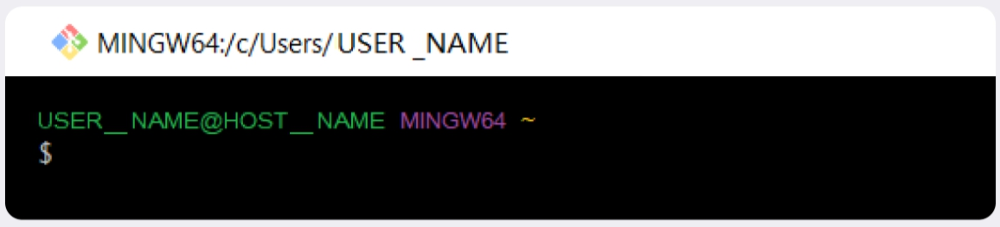

# Командная строка  

__*Тема 3/5 (Командная строка) Урок 1/6*__  

# Установка командной строки для пользователей Windows  

Командная строка — один из основных инструментов взаимодействия с компьютером. Подробнее о ней мы расскажем в следующем уроке. А пока вам может понадобиться выполнить подготовительные действия.  

> ⚠️ Если вы пользователь *macOS* или *Linux*, смело пропускайте этот урок — командная строка у вас уже установлена. Но если ваш компьютер работает на базе Windows, вам понадобится установить командную строку вручную. Для этого следуйте инструкции ниже.  

## Инструкция по установке для пользователей Windows  

Windows поставляется с консолью — как и другие операционные системы. Но при этом команды консоли Windows и macOS/Linux отличаются друг от друга.  
В повседневной работе большинство пользователей Git используют консоли с наборами команд, похожие на те, что применяют в macOS и Linux. В нашем курсе вы будете учиться делать то же самое. Для этого нужно установить специальный консольный инструмент для Windows, который называется __Git Bash__.  
Есть несколько способов установки. Мы рекомендуем пакет __Git for Windows__. Он установит не только __Bash__, но и сам __Git__, который всё равно понадобится вам дальше. Вот что нужно сделать:  

1. Перейдите [на эту страницу официального сайта Git](https://git-scm.com/download/win).  
2. Скачайте одну из двух версий из категории __Standalone Installer__ (англ. «автономный установщик»). Узнать тип вашей системы Windows можно в настройках.  
3. Запустите программу установки. Обратите внимание, куда будет установлен Git. Обычно это директория `C:\Program Files\Git`.  
4. Проверьте, что в списке устанавливаемых программ стоит галочка напротив пункта __Git Bash Here__ — это позволит открывать консоль с Git в любой папке.  
5. Далее установщик предложит много опций. Для нашего курса достаточно оставить все настройки по умолчанию. Несколько раз нажмите __Next__ (англ. «далее»), пока не начнётся процесс установки.  
6. После окончания установки нажмите __Finish__ (англ. «завершить»).  

## Первый запуск Git Bash  

Запустите программу Git Bash. Сделать это можно двумя способами. Можно ввести название программы в окно поиска на панели задач.  

А можно открыть директорию, в которую был установлен Git. Обычно это директория `C:\Program Files\Git\bin`. Перейдите в `bin` и запустите файл `bash.exe`.  

Откроется консоль, в которой будет написано что-то похожее.

Вместо `USER_NAME` будет указано ваше имя пользователя, а вместо `HOST_NAME` — имя компьютера. Если вы видите консоль, значит, установка прошла успешно. В нескольких следующих уроках покажем, как работать с ней.  
Теперь на вашем компьютере есть не только командная строка, но и Git. Устанавливать его вам уже не потребуется. 

---
