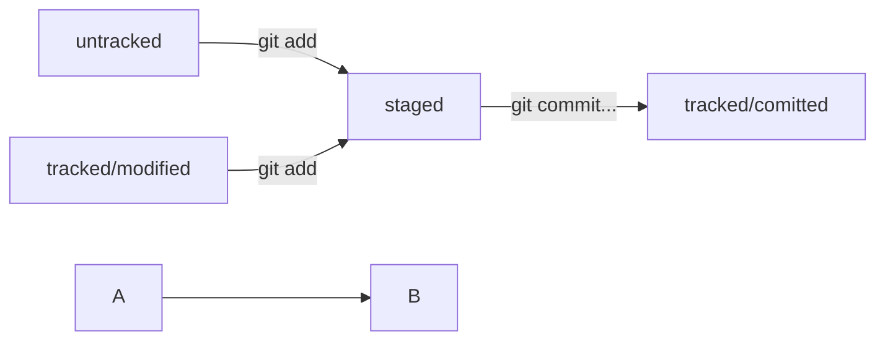

# Работа над ошибками в коммитах  

__*Тема 6/8 (Работа над ошибками в коммитах) Урок 1/5*__  

# Оформление сообщений к коммитам  

То, как написаны сообщения коммитов, тоже может подчиняться определённым правилам. Иногда эти правила продиктованы культурой команды, а иногда техническими ограничениями.  
Например, в выводе команды `git log --oneline` умещается максимум __72__ первых символа сообщения, поэтому многие правила включают пункт: «Сообщение не должно быть длиннее __72__ символов».  
В этом уроке рассмотрим несколько популярных подходов к оформлению сообщений коммитов. Но сначала разберём, почему такие сообщения важны и зачем соблюдать правила их оформления.  

## Зачем вообще писать сообщения  

У каждого коммита в Git есть сообщение — то, что передаётся после параметра `-m`. Например: `git commit -m "Добавить урок про оформление сообщений коммитов"`.  
Сообщения коммитов можно сравнить с надписями на коробках в кладовке. Если надписей нет, то нужную коробку будет сложно найти: придётся заглянуть в каждую, чтобы понять, что там. А если надписи есть, то нужная найдётся сразу.  
Как и надпись на коробке, сообщение коммита должно помочь определить, что внутри. Например, надпись на коробке «всякое разное» не очень полезная. Сообщение коммита «небольшие исправления» тоже: непонятно, что было исправлено в таком коммите и зачем.  
Есть общие рекомендации по тому, как правильно составить сообщение. Оно должно быть:  

- относительно коротким, чтобы его было легко прочитать;  
- информативным.  

Вот пример полезного сообщения в репозитории новостного сайта: `Исправление опечатки в заголовке главной страницы на хорватском`. Такое сообщение даёт много информации:

- `Исправление опечатки` значит, что исправлена ошибка, которая была допущена при наборе. Такое исправление не меняет смысл. То есть, например, главному редактору не нужно перепроверять этот заголовок.  
- `На хорватском` говорит о том, что переводчикам на другие языки этот коммит можно смело пропускать.  
- `В заголовке главной страницы` указывает, где произошли изменения. Если, например, кто-то зайдёт на сайт и ему не понравится новый заголовок, он легко найдёт по истории (`git log`) автора этого коммита и спросит у него, почему заголовок теперь такой.  

Пример плохого сообщения для того же коммита: `Исправлена опечатка`. Это сообщение даёт мало информации. В такой коммит придётся «заглядывать» — разбираться, что именно поменялось и зачем.  

## Стили оформления  

Все люди разные и у всех есть предпочтения — в том числе, как формулировать сообщения коммитов. Кто-то использует инфинитивы: `Исправить сообщение об ошибке E123`, кто-то — глаголы в прошедшем времени: `Исправил…`, кто-то — существительные: `Исправление…`.  
Без единообразия коммитов нет и эффективной работы в Git. Это может показаться мелочью, но когда коммиты с сообщениями в разных стилях идут друг за другом, их может быть сложно читать.  
Чтобы упростить работу, команды или даже целые компании часто договариваются об определённом стиле (то есть о правилах) оформления сообщений коммитов.  
Например, правила могут быть такие:  

- длина сообщения от 30 до 72 символов;  
- первое слово — глагол в инфинитиве («исправить», «дополнить», «добавить» и другие);  
- и так далее.  

Есть много подходов к оформлению сообщений коммитов, но мы расскажем о нескольких популярных. Их используют как отдельные команды, так и целые проекты.  

## Корпоративный  

Во многих компаниях применяется __Jira__ — система для организации проектов и задач. У каждой задачи в __Jira__ есть идентификатор из нескольких заглавных латинских букв и номера. Например, `LGS-239` значит, что это __239-я задача в проекте LGS__ (сокращение от англ. *logistics* — «логистика»).  

В корпоративном стиле в начале сообщения обычно указывают __Jira-ID__, а после — __текст сообщения__.

```text
git commit -m "LGS-239: Дополнить список пасхалок новыми числами" 
```

Какие-то команды могут договариваться, с какой части речи начинать сообщение и какой длины оно должно быть, какие-то — нет. Но требование о наличии __Jira-ID__ обычно строгое: __оно позволяет автоматически связывать коммиты с задачами и проектами__.  

## Conventional Commits  

Стандарт __Conventional Commits__ (англ. «соглашение о коммитах») отличается качественной документацией и подробной проработкой. Он подходит для репозиториев с исходным кодом программ. Использовать его для других типов проектов (например, для перевода книги) было бы неудобно.  
__Conventional Commits__ предлагает такой формат коммита: `<type>: <сообщение>`. Первая часть `type` — это тип изменений. Таких типов достаточно много. Вот два примера:

- `feat` (сокращение от англ. *feature*) — для новой функциональности;
- `fix` (от англ. «исправить», «устранить») — для исправленных ошибок.  

Более подробный список можно увидеть на [сайте с описанием этого стиля](https://www.conventionalcommits.org/ru/v1.0.0-beta.4/#%D1%81%D0%BF%D0%B5%D1%86%D0%B8%D1%84%D0%B8%D0%BA%D0%B0%D1%86%D0%B8%D1%8F).  

Например, сообщение может быть таким.

```text
git commit -m "feat: добавить подсчёт суммы заказов за неделю" 
```

## GitHub-стиль  

GitHub можно использовать не только для хранения файлов проекта, но и для ведения списка задач (англ. *issue*) этого проекта. Если коммит «закрывает» или «решает» какую-то задачу, то в его сообщении удобно указывать ссылку на неё. Для этого в любом месте сообщения нужно указать `#<номер задачи>`. Например, вот так.  

```text
git commit -m "Исправить #334, добавить график температуры" 
```

В таком случае GitHub свяжет коммит и задачу.  

> 💡 Инфинитив и императив  
Для сообщений на __русском__ языке часто рекомендуют использовать __инфинитивы__. Например: `Добавить тесты для PipkaService`, `Исправить ошибку #123` и так далее.  
Для сообщений на __английском__ рекомендуется использовать __повелительное наклонение__ (англ. *imperative*). Например: `Use library mega_lib_300`, `Fix exit button` и так далее.  
Эти рекомендации сложились исторически, и им следуют многие проекты.  

---
Работать над проектом с понятными сообщениями коммитов приятно!  
Правильно описывать коммиты — искусство, к которому стоит приобщиться как можно раньше. Хорошо, когда:  

- сообщение коммита легко читается;
- оно информативное;
- все сообщения оформлены в одном стиле.  

---

__*Тема 6/8 (Работа над ошибками в коммитах) Урок 2/5*__  

# Практическая работа №2. Дополняем шпаргалку  

Работа над самой удобной шпаргалкой по Git ещё не закончена — в этот раз вы дополните её.  
Мир IT не стоит на месте: в нём постоянно происходят перемены. Например, в коммерческой разработке готовый код редко остается без изменений: обновляются фреймворки, добавляются и совершенствуются функциональности, непрерывно оптимизируется работа всего проекта.  

> 🔑 Кстати, фреймворки и библиотеки значительно облегчают разработку проекта. К ним относятся, например, __Flask__ — микрофреймворк для создания веб-приложений на языке __Python__; __React__ — библиотека с открытым исходным кодом для разработки пользовательских интерфейсов на __JavaScript__; __Express__ — фреймворк для среды разработки __Node.js__, и так далее.  

Подробнее об этих и прочих популярных технологиях, вы можете узнать на наших курсах по программированию — [__«Python-разработчик плюс»__](https://practicum.yandex.kz/python-developer-plus/?from=catalog), [__«Фулстек-разработчик»__](https://practicum.yandex.kz/fullstack-developer/?from=catalog) и других. Вводная часть этих курсов бесплатная...  
  
Подобно всем реальным проектам, ваша шпаргалка тоже требует обновления — ведь с момента прошлой практической работы вы узнали много нового. Дополните её:

1. Добавьте в шпаргалку основную информацию из уроков о хеше, логе, `HEAD`, статусах файлов и оформлении сообщений к коммитам.  

2. Информацию из каждого урока заливайте новым коммитом. Так вам будет проще отслеживать, как меняется шпаргалка и увеличивается объём ваших знаний.  

    > 💡 Пишите понятные и информативные сообщения к коммитам. Используйте ключевые слова из названий уроков. Например: `Добавить раздел про HEAD, Дополнить инфу про git log` и так далее.  

3. Особое внимание уделите материалу о статусах и жизненном цикле файлов в Git. Схему изменения статусов можно описать словами. Например, `modified` + `git add` = `staged`.  

*А можно усложнить задачу!*  
Попробуйте использовать формат описания схем [Mermaid](https://github.blog/2022-02-14-include-diagrams-markdown-files-mermaid/). Принцип такой: вы описываете схему в специальном текстовом формате, а GitHub превращает описание в полноценную схему с блоками и стрелками.

---

## Подсказка: как сделать mermaid-схему  

Чтобы получить `mermaid`-схему в `README.md`, нужно добавить блок кода типа `mermaid`.  

```text
HEAD -- это голова.  
Коммит -- это всему голова.  
Статусы файлов:  

<тут пустая строка!>  
  \```mermaid  
  %% описание схемы  
  \```  

<и тут пустая строка!>
```

Блоки кода в маркдауне начинаются и заканчиваются тремя символами ` ``` `. После первых трёх ` ``` ` можно указать, какой именно код будет внутри блока. Например: __mermaid__, __bash__, __python__, __javascript__ и так далее. Если ничего не указать, GitHub будет считать весь код простым текстом.  

> 💡 Перед блоком и после него нужны пустые строки, иначе GitHub может не понять, что это блок кода.  

- Два символа `%%` обозначают в `mermaid` строку-комментарий.  
- Чтобы сделать схему, нужно указать формат: `graph LR`. __Graph__ — это простейший тип схем; для шпаргалки его будет достаточно.  
- Чтобы добавить элементы и связи (стрелки), используют строки вида `A --> B`. Такая строка создаст квадратные блоки `А` и `B` и соединит их стрелкой.  

Дополнительно можно указывать текст на стрелке. Например, так: `A -- "text" --> B`.  
Ниже вы найдёте заготовку для схемы статусов файлов.



Попробуйте описать схему самостоятельно и посмотреть, что получится!

---

__*Тема 6/8 (Работа над ошибками в коммитах) Урок 3/5*__  

# Как исправить коммит

Иногда в только что выполненном коммите нужно что-то поменять: например, добавить ещё пару файлов или заменить сообщение на более информативное.  
В таком случае можно внести правки в уже сделанный коммит с помощью опции `--amend` (от англ. *amend* — «исправить», «дополнить») у команды `commit`: `git commit --amend`. Разберём, как она работает.  

> 💡 __Важно__: опция `--amend` работает только с последним коммитом (`HEAD`). Для исправления более ранних коммитов есть другие команды. Мы рассмотрим их в следующих модулях курса.  

## Подготавливаем репозиторий  

Создайте тренировочный репозиторий для отработки команды.  

```text
$ mkdir ~/dev/commit-amend-fun
$ cd ~/dev/commit-amend-fun
$ git init
# пропустим вывод git init 
```

## Дополнить коммит новыми файлами — `git commit --amend --no-edit`  

Представьте, что делаете небольшой сайт и для этого создали файл-страницу `main.html`, а также файл со стилями `common.css`.  

```text
$ touch main.html
$ touch common.css
# дальше отредактировали оба файла 
```

В какой-то момент вы забыли о файле `common.css` и добавили в коммит только `main.html`.  

```text
$ git add main.html
$ git commit -m "Добавить главную страницу"
$ git log --oneline
777fec3 Добавить главную страницу 
```

__Напомним__, что если вы повторяете за нами эти действия локально, у вас будут другие хеши коммитов.  
Файл `common.css` так и остался «висеть» в `untracked`. В этом легко убедиться, если вызвать `git status`.  

```text
$ git status
On branch main
Untracked files:
  (use "git add <file>..." to include in what will be committed)
          common.css

nothing added to commit but untracked files present (use "git add" to track) 
```

Дополните последний коммит забытым файлом `common.css` с помощью опции `--amend`.

```text
$ git add common.css
# добавили файл common.css в список на коммит как обычно

# но вместо команды commit -m '...'
# будет:
$ git commit --amend --no-edit

$ git log --oneline
8340eb2 Добавить главную страницу
# коммит в истории всё ещё один (но у него новый хеш) 
```

С опцией `--amend` команда `commit` не создаст новый коммит, а дополнит последний, просто добавив в него файл `common.css`.  При этом хеш последнего коммита изменится, потому что изменился список файлов в коммите.  
Обратите внимание на опцию `--no-edit`. Она сообщает команде `commit`, что сообщение коммита нужно оставить как было.
Точно так же можно добавить не новый файл, а дополнительные изменения в уже добавленном в коммит файле.  

```text
# ещё раз отредактировали main.html

$ git add main.html # добавили в список на коммит
$ git commit --amend --no-edit 
```

>💡 Что же выбрать: __новый коммит__ или `--amend`?
 В нашем примере вместо изменения последнего коммита можно было также выполнить новый коммит с одним файлом `common.css`. Кажется, что так проще, но добавить изменения в уже существующий коммит может быть правильнее.  
 Например, через месяц кто-то захочет просмотреть историю изменений. Намного проще понять, что изменилось, если оба файла находятся в одном коммите. Иначе коммит со второй порцией изменений придётся искать.  

## Изменить сообщение коммита — `git commit --amend -m "Новое сообщение"`  

Может быть и так, что добавлять новые файлы в коммит не нужно, зато понадобилось изменить сообщение.  
Допустим, хочется заменить сообщение Добавить главную страницу на Добавить главную страницу и стили. Сделать это можно через `commit --amend` с флагом `-m`.  

```text
$ git commit --amend -m "Добавить главную страницу и стили"
$ git log --oneline
a31fa24 Добавить главную страницу и стили 
```

Хеш коммита снова поменялся, потому что изменились сообщение и время коммита. При этом файлы в коммите остались те же: `main.html` и `common.css`.  

## Случилось страшное: открылся редактор  

Если забыть указать у команды `git commit --amend` один из флагов (`--no-edit` или `-m`), Git предложит отредактировать сообщение коммита вручную. Для этого он откроет текстовый редактор, который установлен в системе по умолчанию. Чаще всего это либо __GNU nano__, либо __Vim__.  

### nano — простой и свободный  

  > 💡 В надписях вида `^X`, `^G` и других «шляпка» `^` обозначает кнопку `Ctrl`. То есть `^X` — это то же самое, что и `Ctrl+X`.  

  После нажатия `Ctrl+X` nano предложит сохранить файл, для этого нужно нажать `Y` (от англ. *yes*).  
  Затем редактор предложит изменить имя файла, но делать этого не нужно — просто нажмите `Enter`.  
  После нажатия  `Enter` редактор закроется, а Git изменит сообщение последнего коммита.  

  > 💡 Если вы не хотите менять сообщение через редактор, можно выйти из него с помощью `Ctrl+X`, а затем выбрать `N` (от англ. *no*). В таком случае редактор закроется, и Git оставит сообщение последнего коммита «как было».  

### Vim — великий и ужасный  

  Если не откроется __nano__, то, скорее всего, откроется __Vim__.
  Если вы ещё не умеете пользоваться Vim, мы рекомендуем сразу выйти из редактора и использовать флаг `-m` для указания сообщений коммита. Вот как выйти из Vim:  

1. Нажмите клавишу `Esc`.
2. Наберите последовательность символов `:qa!`.
3. Нажмите `Enter`.  

  После нажатия `Enter` редактор должен закрыться, а вы сможете продолжить работу так, как будто ничего и не открывалось.

> 💡 __Vimtutor__  
>Редактор *Vim* — полезный инструмент, но его интерфейс сложно назвать интуитивным. И всё же во многих дистрибутивах это текстовый редактор по умолчанию. Если ваша текущая или будущая профессия связана с работой в консоли *Linux*, рекомендуем заглянуть в учебник по работе с *Vim*.  
>
> Для запуска учебника на русском языке достаточно выполнить команду `vimtutor ru`. Без `ru` запустится английская версия.  

---
В ходе работы вам наверняка ещё не раз понадобится внести какие-то исправления в историю коммитов. Флаг `--amend` — ваш союзник. Коротко подытожим урок:

- `--amend` рассчитан на работу с последним коммитом (HEAD).
- Дополнить коммит новыми файлами можно с помощью `git commit --amend --no-edit`. Благодаря опции `--no-edit` сообщение к коммиту останется таким, каким и было.
- Изменить сообщение к коммиту позволяет команда `git commit --amend -m "Обновлённое сообщение коммита"`.  

---

__*Тема 6/8 (Работа над ошибками в коммитах) Урок 4/5*__  

# Как откатиться назад, если «всё сломалось»  

На разных этапах работы с Git могут происходить похожие ситуации:  

- В список на коммит попал лишний файл (например, временный). Нужно «вынуть» его из списка.  
- Последние несколько коммитов ошибочные: например, сделали не то, что было нужно, или нарушили логику. Хочется «откатить» сразу несколько коммитов, вернуть «как было вчера».  
- Случайно изменился файл, который вообще не должен был меняться. Например, вы открыли не тот файл в редакторе и начали его исправлять.  

В этом уроке рассмотрим такие случаи и научим вас «откатывать» нежелательные изменения.

## Выполнить unstage изменений — `git restore --staged <file>`  

Допустим, вы создали или изменили какой-то файл и добавили его в список «на коммит» (`staging area`) с помощью `git add`, но потом передумали включать его туда. Убрать файл из `staging` поможет команда `git restore --staged <file>` (от англ. *restore* — «восстановить»).  

> 💡 В выводе команды `git status` есть подсказка в скобках: `use "git restore --staged <file>..." to unstage`. Так что, даже если вы и забыли эту команду, Git напомнит вам.  

В терминале это будет выглядеть примерно так.

```text
$ touch example.txt # создали ненужный файл
$ git add example.txt # добавили его в staged

$ git status # проверили статус
Changes to be committed:
  (use "git restore --staged <file>..." to unstage)
        new file:   example.txt

$ git restore --staged example.txt
$ git status # проверили статус

Untracked files:
  (use "git add <file>..." to include in what will be committed)
        example.txt

no changes added to commit (use "git add" and/or "git commit -a")
# файл example.txt из staged вернулся обратно в untracked 
```

Вызов `git restore --staged example.txt` перевёл `example.txt` из `staged` обратно в `untracked`.  

Чтобы «сбросить» все файлы из `staged` обратно в `untracked`/`modified`, можно воспользоваться командой `git restore --staged .`: она сбросит всю текущую папку (`.`).  

> 💡 Раньше для этой операции использовали команду `git reset HEAD`. Но `git reset` «перегруженная»: она умеет делать много разных действий в зависимости от переданных параметров. Чтобы было меньше путаницы, в Git была добавлена отдельная команда `git restore`.  

## «Откатить» коммит — `git reset --hard <commit hash>`  

Иногда нужно «откатить» то, что уже было закоммичено, то есть вернуть состояние репозитория к более раннему. Для этого используют команду `git reset --hard <commit hash>` (от англ. *reset*  — «сброс», «обнуление» и *hard* — «суровый»).  

```text
$ git log --oneline # хеш можно найти в истории
7b972f5 (HEAD -> master) style: добавить комментарии, расставить отступы
b576d89 feat: добавить массив Expenses и цикл для добавления трат # вот сюда и вернёмся
4b58962 refactor: разделить analyzeExpenses() на countSum() и saveExpenses()

$ git reset --hard b576d89
# теперь мы на этом коммите
HEAD is now at b576d89 feat: добавить массив Expenses и цикл для добавления трат 
```

Теперь коммит `b576d89` стал последним: вся дальнейшая разработка будет вестись от него. Файл также вернулся к тому состоянию, в котором был в момент этого коммита. А коммит `7b972f5` Git просто удалил. Это можно проверить, снова запросив лог. Он покажет следующее.  

```text
$ git log --oneline
b576d89 (HEAD -> master) feat: добавить массив Expenses и цикл для добавления трат
4b58962 refactor: разделить analyzeExpenses() на countSum() и saveExpenses() 
```

Вот так схематично выглядит весь процесс «отката» с помощью `git reset --hard <hash>`.


Будьте осторожны с командой `git reset --hard`! При удалении коммитов можно потерять что-то нужное.

## «Откатить» изменения, которые не попали ни в __staging__, ни в коммит, — `git restore <file>`  

Может быть так, что вы случайно изменили файл, который не планировали. Теперь он отображается в `Changes not staged for commit` (`modified`). Чтобы вернуть всё «как было», можно выполнить команду `git restore <file>`.  

```text
# случайно изменили файл example.txt
$ git status
On branch main
Changes not staged for commit:
  (use "git add <file>..." to update what will be committed)
  (use "git restore <file>..." to discard changes in working directory)
          modified:   example.txt

$ git restore example.txt
$ git status
On branch main
nothing to commit, working tree clean 
```

Изменения в файле «откатятся» до последней версии, которая была сохранена через `git commit` или `git add`.  

---

> - Вы сделали коммит, после которого «всё сломалось». Какую команду использовать, чтобы «откатить» репозиторий на более ранний коммит?  
>   `git reset --hard <более ранний коммит>`  
> - Вы добавили изменения в `staging area` и хотите вернуть их в `modified`. Какую команду выбрать?  
>   `git restore --staged <файл>`  
> - Вы случайно изменили файл, который вообще не хотели менять. Но в `staging`` его пока не добавили. Какую команду нужно выполнить?  
>   `git restore <файл>`  

---
Вот о чём мы рассказали:  

- Команда `git restore --staged <file>` переведёт файл из `staged` обратно в `modified` или `untracked`.  
- Команда `git reset --hard <commit hash>` «откатит» историю до коммита с хешем `<hash>`. Более поздние коммиты потеряются!  
- Команда `git restore <file>` «откатит» изменения в файле до последней сохранённой (в коммите или в `staging`) версии.  

---
