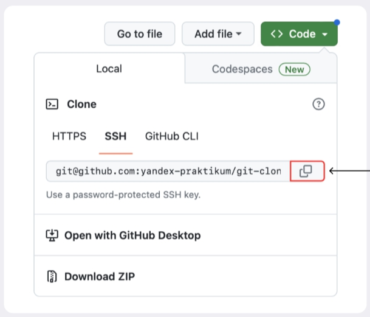
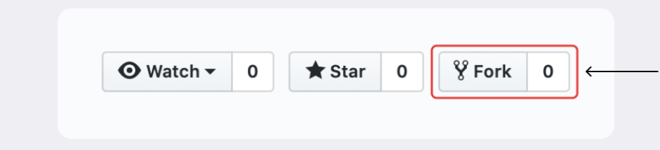
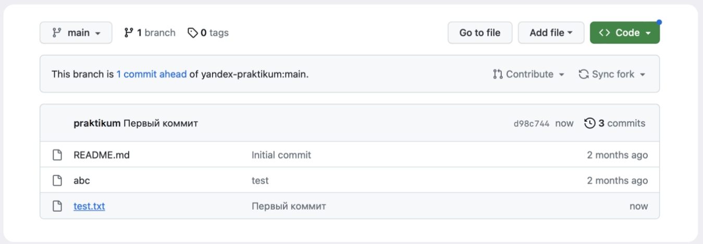

# Основы работоты с ветками в Git  

__*Тема 1/6 - Копирование репозиториев*__  

## О чём этот модуль  

В предыдущих модулях мы рассказали о системе контроля версий Git и о том, как работать с командной строкой, создавать локальный репозиторий и синхронизировать его с удалённым. А также как коммитить, «откатываться», просматривать различия между версиями и делать многое другое.  

Всё это — полезные и нужные знания, которые составляют основу работы с Git. Но до сих пор в фокусе нашего внимания была индивидуальная работа. А ведь одна из ключевых возможностей Git — командное взаимодействие.  

Этот модуль посвящён базовым навыкам для работы с Git и GitHub в команде. Мы разберём:  

- Как выполнять клонирование и «форк». Эти операции позволяют создать копию удалённого Git-репозитория, а потом работать с файлами на локальном компьютере или завести собственный репозиторий на основе уже существующего.  
- Что такое ветки, как их создавать разными способами, переключаться между ними и сравнивать их. Ветки позволяют членам команды работать над проектом независимо и при этом не мешать другим участникам процесса.  
- Как объединять изменения из разных веток — выполнять их слияние, а затем разрешать возможные конфликты.  
- Как через GitHub делать запрос на такое объединение — для последующей проверки изменений и их добавления в основную ветку.

К концу модуля вы будете уверенно выполнять эти операции, научитесь одновременно экспериментировать с проектом и сохранять стабильную версию репозитория. А ещё сделаете первые шаги на пути к использованию Git и GitHub в команде.  

---

__*Тема 2/6 (Копирование репозиториев) - Урок 1/3*__  

# Клонируем репозиторий  

На платформе GitHub хранится множество проектов. Часть из них находится в открытом доступе. Такие open source проекты можно скачать на свой компьютер, внести какие-то правки или просто разобраться, как всё устроено внутри.  
Процесс копирования удалённого репозитория на локальный компьютер называется клонированием. Клонирование репозитория — обычно первое, что делает разработчик на новом месте работы. Вы сымитируете эту ситуацию в уроке.  

## Клонировать репозиторий — `git clone`  

Откройте [этот репозиторий](https://github.com/yandex-praktikum/git-clone-lesson). Нажмите на зелёную кнопку `Code`. Появится окно со ссылкой. Если вы уже настроили SSH-ключ, убедитесь что выбрана опция SSH и нажмите на кнопку с двумя квадратами справа — она скопирует ссылку в буфер обмена. Вы также можете скопировать ссылку вручную.



> ⚠️ Если вы не настраивали SSH-ключ, рекомендуем заглянуть в тему о синхронизации репозиториев (её можно найти в предыдущем модуле) и настроить его. Так работа с GitHub будет более безопасной.  

Теперь откройте консоль, перейдите в папку, в которую хотите положить репозиторий ("корневую", типа `dev` или `test`), и выполните команду `git clone` (от англ. *clone* — «клон», «копия»). Она создаст копию удалённого репозитория на вашем компьютере. В качестве параметра команде нужно передать адрес репозитория, который вы только что скопировали на GitHub.  

```text
$ git clone https://github.com/yandex-praktikum/git-clone-lesson
# укажите адрес репозитория, который нужно склонировать 
```

Команда `git clone` автоматически связывает локальный и удалённый репозиторий. То есть если в GitHub-репозитории что-то поменяется (например, добавятся коммиты), вам не нужно будет заново клонировать его. Достаточно будет выполнить команду, которая обновит вашу копию.  

Убедитесь в том, что репозитории связаны, командой `git remote -v`.  

```text
$ cd git-clone-lesson
$ git remote -v
origin    git@github.com:yandex-praktikum/git-clone-lesson.git (fetch)
origin    git@github.com:yandex-praktikum/git-clone-lesson.git (push) 
```

Теперь на вашей машине есть копия удалённого репозитория.

---

Склонируйте [этот репозиторий](https://github.com/yandex-praktikum/git-clone-practice). С помощью команды `cat` выведите содержимое файла `task.txt` в консоль. Скопируйте содержимое в поле ниже.  

Ваш ответ правильный: `Страшный-престрашный секрет`.  

Вы успешно склонировали репозиторий и даже поработали с его содержимым!

__Самое важное в этом уроке:__

- Команда `git clone` копирует проект на локальный компьютер.  
- `git clone` автоматически связывает локальный репозиторий с удалённым.  

---

__*Тема 2/6 (Копирование репозиториев) - Урок 2/3*__  

# Выполняем Fork  

Допустим, вы хотите усовершенствовать чужой проект или как-то использовать его в своей работе, но у вас нет прав на изменение оригинального репозитория.  
В этом уроке разберём ещё одну полезную операцию копирования проектов. В отличие от клонирования, она не скачает репозиторий на локальный компьютер, но добавит его прямо в ваш аккаунт на сервере GitHub.  

## Что такое Fork  

__Fork__ (англ. «развилка», «ответвление»), или «__форк__», — это GitHub-операция; напрямую с Git она не связана. «Форк» создаёт копию репозитория в аккаунте GitHub. Такая копия будет полностью независима. Изменения, которые вы внесёте, не будут синхронизированы с исходным репозиторием.  

В процессе «форка» создаётся копия всех файлов, истории коммитов и веток. Эта копия сохраняется в вашей учётной записи GitHub.  

Вот некоторые из распространённых причин использования «форков»:  

- Вы хотите внести свой вклад в проект (например, *open source*), но не имеете прав на изменение исходного репозитория. Тогда вы можете сделать «форк», добавить нужные правки, а затем отправить запрос на включение этих изменений в оригинальный проект.  
- Вы хотите развивать проект независимо от исходного. Допустим, создатели проекта решили, что не будут добавлять функциональность, которая вам необходима. В таком случае вы можете сделать «форк» и добавить её самостоятельно.  

## Применяем Fork  

Потренируйтесь выполнять «форк». Перейдите по [этой ссылке](https://github.com/yandex-praktikum/git-basics) и нажмите на кнопку Fork в правом верхнем углу.  



В открывшемся окне вы можете поменять название и описание репозитория. Или поставить галку, чтобы склонировать только главную ветку вместо всех сразу. Нажмите __Create fork__ (англ. **«создать копию репозитория»).


Немного подождите, пока репозиторий скопируется. После этого он будет доступен по адресу `https://github.com/%USERNAME%/git-basics`, где `%USERNAME%` — ваше имя пользователя.  
В результате вы получите полную копию исходного репозитория, которую можно свободно изменять и которой можно управлять.  

> 💡 __«Форк» или__ `clone`?  
 Обычно комбинация «форк» + `clone` используется для внесения изменений в публичные репозитории. В этом случае «форк» становится подготовительным этапом перед клонированием чужого репозитория на ваш компьютер.  
 Если репозиторий приватный или это репозиторий вашей компании, при работе с ним достаточно `clone`.  

Теперь внесите изменения в новый репозиторий. Для начала скопируйте его локально.  

```text
$ git clone git@github.com:%ВАШ_АККАУНТ%/git-basics.git
# укажите адрес репозитория 
```

Когда клонирование будет завершено, перейдите в локальный репозиторий командой `cd`.  
Создайте файл `test.txt`, добавьте в него несколько любых предложений и выполните коммит `git commit -m "Первый коммит"`.  

> 💡 Если ввести `git commit` без флага `-m`, откроется редактор __Vim__. Чтобы выйти из него, нажмите клавишу `Esc`, наберите последовательность символов `:q!` и нажмите `Enter`.  

Отправьте изменения в удалённый репозиторий командой `git push` (от англ. *push* — «толкнуть», «протолкнуть»). Обратите внимание: вам не нужно указывать флаг `-u origin main`. Команда `git clone` сама свяжет удалённые и локальные ветки в момент клонирования.  

Снова откройте браузер с GitHub и обновите страницу. Вы увидите опубликованные вами файл и коммит.  



## Задание для самостоятельной работы  

Проект необязательно начинается с нуля: иногда вдохновение можно найти на просторах GitHub, но при этом решить задачу по-своему.  
Например, на GitHub есть много репозиториев в формате `awesome lists` (англ. «потрясающие списки»). Это репозитории, в которых собраны разные полезные ссылки со всего интернета. Вот некоторые из них:  

- [Шрифты](https://github.com/brabadu/awesome-fonts#readme)  
- [Публичные выступления](https://github.com/matteofigus/awesome-speaking#readme)  
- [Удалённая работа](https://github.com/lukasz-madon/awesome-remote-job#readme)  

Выберите один из этих проектов или любой другой понравившийся. Выполните его «форк», а затем склонируйте локально.  

---
Вы научились «форкать» репозитории. Вот о чём важно помнить:  

- «Форк» позволяет получить точную копию GitHub-репозитория в ваш аккаунт.  
- Копия, которая получена с помощью «форка», полностью независима от оригинального проекта — изменения не будут синхронизированы.  

---

__*Тема 2/6 (Копирование репозиториев) - Урок 2/3*__  

# Практическая работа №1. Скачиваем репозиторий мечты  

Пришло время попрактиковаться! Перед вами первый кейс этого модуля. В нём понадобятся навыки копирования репозиториев. Желаем удачи!  

## Совы и жаворонки  

Представьте, что вы захотели написать с другом Федей небольшой пет-проект. Когда-то друг уже начинал работу над ним — продумал концепцию, завёл локальный репозиторий, оформил файл `README.md` и даже создал проект на GitHub. Но в какой-то момент у Феди перестало хватать времени и проект пришлось отложить в долгий ящик.  
Теперь у друга снова появились время и силы. Вместе веселее, поэтому вы решили работать вдвоём. Вы увлечённо обсуждали идею весь вечер, а потом Федя прислал вам ссылку на свой GitHub-репозиторий. Вам не терпится погрузиться в работу, но вот беда: в отличие от вас Федя жаворонок и сразу ушёл спать. Настроить доступ к репозиторию он благополучно забыл и на звонки уже не отвечает.  
Впереди — вся ночь. Вам очень хочется разобраться в коде и внести первые изменения как локально, так и удалённо, чтобы посмотреть, как будет выглядеть проект на GitHub. Но прав на выполнение `git push` в репозиторий Феди у вас нет.  

## Что нужно сделать  

1. Откройте [репозиторий Феди](https://github.com/yandex-praktikum/git-fork-case).  
2. Подумайте, как скопировать проект. Вам нужно начать локальную работу над репозиторием, но при этом подготовить его удалённую версию, в которую вы могли бы свободно делать `git push`.  
3. Оп! Внутри репозитория Федя оставил для вас загадочный файл `check.sh`. Это исполняемый скрипт, в котором находится секретное слово. Сделать файл исполняемым, а затем исполнить его можно с помощью набора команд.  

```text
 $ chmod +x check.sh # эта команда сделает файл исполняемым
 $ ./check.sh # эта команда исполнит скрипт
 #
 ```
  
Если вы сделали всё правильно, в выводе программы появится ключ в формате `Секретный ключ: %КЛЮЧ%`. Скопируйте ключ (часть после двоеточия) в поле ввода ниже.  

Ваш ответ  
Написать  

# Практическая работа №1. Скачиваем репозиторий мечты  

Пришло время попрактиковаться! Перед вами первый кейс этого модуля. В нём понадобятся навыки копирования репозиториев. Желаем удачи!  

## Совы и жаворонки  

Представьте, что вы захотели написать с другом Федей небольшой пет-проект. Когда-то друг уже начинал работу над ним — продумал концепцию, завёл локальный репозиторий, оформил файл `README.md` и даже создал проект на GitHub. Но в какой-то момент у Феди перестало хватать времени и проект пришлось отложить в долгий ящик.  

Теперь у друга снова появились время и силы. Вместе веселее, поэтому вы решили работать вдвоём. Вы увлечённо обсуждали идею весь вечер, а потом Федя прислал вам ссылку на свой GitHub-репозиторий. Вам не терпится погрузиться в работу, но вот беда: в отличие от вас Федя жаворонок и сразу ушёл спать. Настроить доступ к репозиторию он благополучно забыл и на звонки уже не отвечает.  

Впереди — вся ночь. Вам очень хочется разобраться в коде и внести первые изменения как локально, так и удалённо, чтобы посмотреть, как будет выглядеть проект на GitHub. Но прав на выполнение `git push` в репозиторий Феди у вас нет.  

## Что нужно сделать  

1. Откройте репозиторий Феди.  
2. Подумайте, как скопировать проект. Вам нужно начать локальную работу над репозиторием, но при этом подготовить его удалённую версию, в которую вы могли бы свободно делать `git push`.  
3. Оп! Внутри репозитория Федя оставил для вас загадочный файл `check.sh`. Это исполняемый скрипт, в котором находится секретное слово. Сделать файл исполняемым, а затем исполнить его можно с помощью набора команд.  

    ```text
    $ chmod +x check.sh # эта команда сделает файл исполняемым
    $ ./check.sh # эта команда исполнит скрипт
    ```

Если вы сделали всё правильно, в выводе программы появится ключ в формате Секретный ключ: %КЛЮЧ%. Скопируйте ключ (часть после двоеточия) в поле ввода ниже.
```text
# Ваш ответ правильный
# practicum
```

Супер: вы успешно выполнили «форк» и клонирование репозитория!

---
