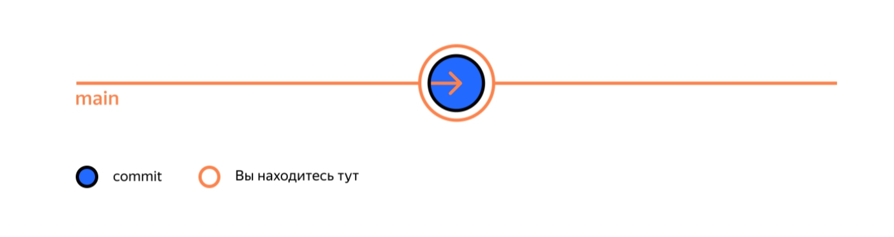
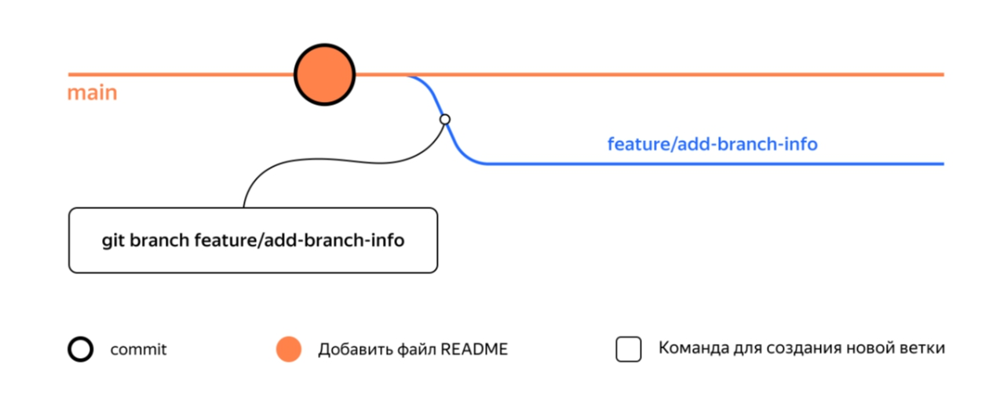
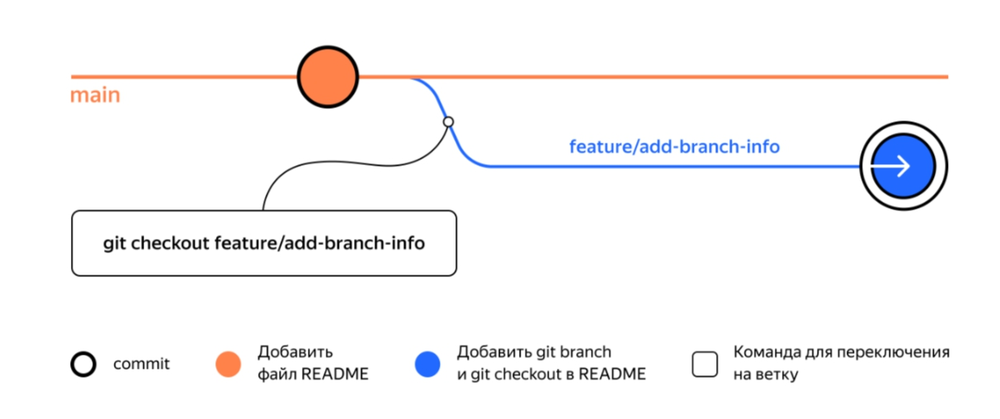
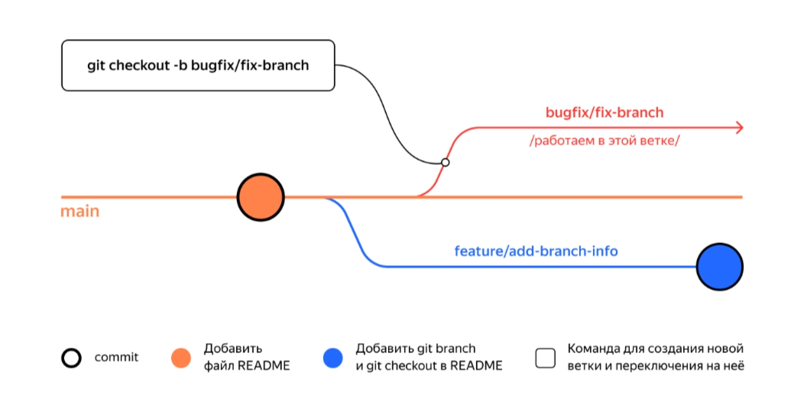
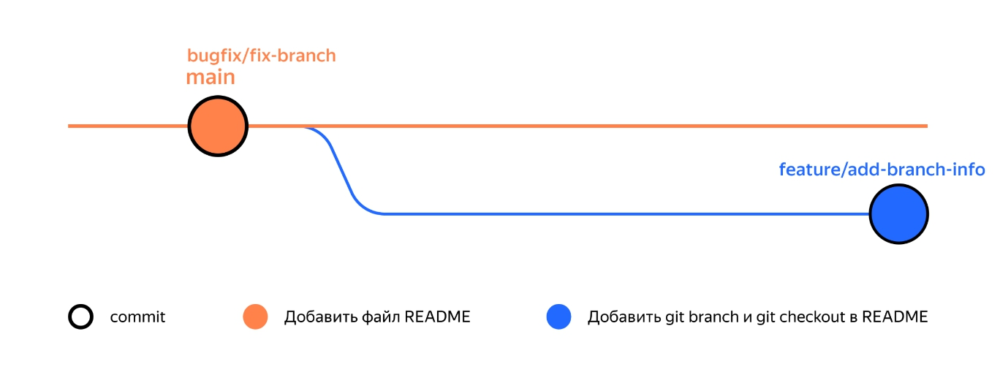
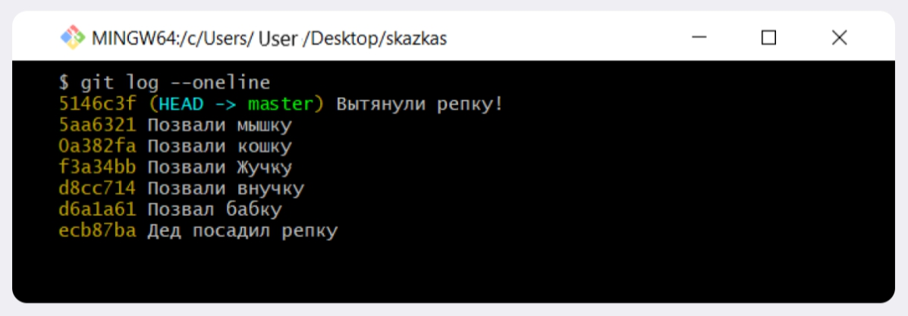

# Ветки: создание, навигация, сравнение  

__*Тема 3/6 (Ветки: создание, навигация, сравнение ) - Урок 1/5*__  

# Что такое ветка  

Представьте: ваш рабочий проект запущен и у него уже появились пользователи. Вам пришла идея, как его ускорить. Но нужно провести эксперимент — изменить код и посмотреть, будет ли программа работать быстрее. В процессе важно скооперироваться с коллегами и ничего не сломать — в этом помогут ветки.  

## Зачем нужны ветки  

__Ветка__ (англ. *branch*) — это изолированный поток разработки проекта. В таком потоке можно проверять разные идеи, тестировать новую функциональность и так далее.  
Ветки позволяют экспериментировать с проектом в Git, но при этом сохранять репозиторий в стабильном состоянии. Каждый член команды может работать в своей ветке и не мешать другим: коммиты, которые он сделает, не будут видны из других веток. А когда работа будет доделана, ветки можно соединить.  
Ветки полезны, даже если вы работаете в одиночку — например, над сайтом. Прежде чем писать новую функциональность, для неё следует создать отдельную ветку. Также ветки позволяют одному человеку переключаться между несколькими задачами сразу.  

Основная, стабильная версия проекта хранится в главной ветке `main` или `master`. Она появляется автоматически при создании репозитория. Часто все новые ветки в репозитории отходят от `main`, хотя это не является правилом.  

> ⚠️ Далее в наших примерах мы будем обозначать основную ветку как `main`. Обращайте на это внимание и не забывайте менять команды, если ваша ветка называется `master`.  

## Просмотреть ветки проекта — `git branch`  

Теперь покажем, как получить список веток проекта. Создайте тестовый проект `learn_branches`. Добавьте в него файл `README.md`, проиндексируйте изменения и сделайте коммит: `git commit -m "Выполнить первый коммит"`.  

> 💡 Вспомните, что несколько команд можно объединять в одной строке терминала символом логического «и» — `&&`.  

```text
$ mkdir learn_branches && cd learn_branches && git init # создали новый репозиторий
$ touch README.md # создали файл

$ git add . # команда git add с флагом-точкой подготовит к сохранению текущую папку; вместо этого можно вызвать git add --all
$ git commit -m "Выполнить первый коммит"  
```

Репозиторий создан, файлы добавлены и закоммичены. В репозитории появилась главная ветка. Это можно проверить командой для просмотра веток `git branch`.  

```text
$ git branch 
* main # мы в основной ветке

# чтобы выйти из просмотра веток, может понадобиться Q! 
```

При вызове `git branch` выводятся ветки, которые есть в проекте. Звёздочкой (`*`) отмечено, в какой ветке вы находитесь в текущий момент.  
Сейчас проект `learn_branches` выглядит так.  


## Дополняем ветку  

Добавьте в `README.md` следующий текст.

```text
# Описание

Это проект по изучению работы с ветками 
```

Сделайте ещё один коммит.  

```text
$ git add . && git commit -m "Обновить README" 
#
```

Как и предыдущий, этот коммит сохранится внутри главной ветки. Схематически это выглядит так.


Теперь у вас есть два коммита — последовательность изменений. А это уже целая ветка!

Коротко подытожим:  

- Ветка — это последовательность независимых изменений.  
- Благодаря веткам несколько человек могут работать над одним репозиторием и не мешать друг другу. А ещё ветки помогают декомпозировать большую и страшную задачу на маленькие и понятные.  
- Основная версия проекта хранится в главной ветке main (или master).  
- С помощью команды `git branch` можно посмотреть, какие в проекте есть ветки и в какой из них вы сейчас находитесь.  

---

__*Тема 3/6 (Ветки: создание, навигация, сравнение ) - Урок 2/5 (Создаем ветку)*__  

## Создать ветку — `git branch <название_ветки>`  

Инициализируйте новый тестовый проект `git-branches` и создайте в нём файл `README.md`. Откройте файл и добавьте туда следующий текст.  

```text
# Ветки в Git  
```

Добавьте изменения в `staging area` и сделайте коммит с сообщением: `git add . && git commit -m "Добавить файл README"`.  

Для создания веток в Git есть команда `git branch` с параметром в виде названия ветки: `git branch <название_ветки>`. Например, создадим ветку с названием `feature/add-branch-info`.  

> 💡 В названии ветки есть слеш — что это значит?  
>Название ветки в Git может состоять из букв, цифр, а также включать любой из четырёх символов: `.`, `-`, `_`, `/`. Эти символы не несут особого смысла. Например, ветка `feature/add-branch-info` могла бы называться `feature_add-branch-info` или `feature-add-branch`. Обратите внимание, что ветки не образуют иерархии, как директории, разделённые символом `/`.  

Чтобы создать ветку `feature/add-branch-info`, выполните команду `git branch feature/add-branch-info`. Затем выполните `git branch`, чтобы посмотреть список всех веток проекта.

```text
$ git branch feature/add-branch-info # создали ветку feature/add-branch-info
$ git branch # посмотрели ветки
  
  feature/add-branch-info  # появилась новая
* main                     # * значит, что мы находимся в основной ветке 
```

Готово! Сейчас в вашем репозитории две ветки — основная и `feature/add-branch-info`.  


## Как назвать новую ветку  

Есть разные подходы к наименованию веток. Каждая команда разработки выбирает свой. Но независимо от подхода ветки нужно называть так, чтобы другим участникам было понятно, что в них происходит.  
Мы будем использовать указатели `feature` (англ. «особенность», «деталь») для веток, где прорабатывается новая функциональность, и `bugfix` (от англ. *bug* — «жук», «ошибка» и *fix* — «исправить») для веток, где ведётся работа по исправлению ошибок.  

После ключевого слова идёт слеш и описание проблемы или задачи (например, `/add-branch-info`). Это описание не должно содержать пробелов — следует использовать нижнее подчёркивание или дефис. В наших примерах мы будем использовать дефис.

Теперь вы умеете создавать ветки с помощью команды `git branch <название_ветки>`.  

---

__*Тема 3/6 (Ветки: создание, навигация, сравнение ) - Урок 3/5 (Шагаем с ветки на ветку)*__  

## Переключиться на другую ветку — `git checkout <название_ветки>`  

Чтобы начать работу в `feature/add-branch-info`, перейдите в неё с помощью команды `git checkout` с флагом — названием ветки: `git checkout feature/add-branch-info`.  

```text
$ git checkout feature/add-branch-info # перешли в новую ветку
Switched to branch 'feature/add-branch-info'

$ git branch # проверили

* feature/add-branch-info # теперь находимся тут
  main 
```

Строчка `Switched to branch...` (англ. «переключено на ветку…») сообщает, на какую ветку вы только что переключились.  

Откройте файл `README.md` и добавьте в него информацию о командах `git branch` и `git checkout`. Получится следующее.  

```text
# Ветки в Git 

Чтобы создать ветку, необходимо выполнить команду `git branch %BRANCH_NAME%`.

Для перехода в ветку есть команда `git checkout %BRANCH_NAME%`. 
```

Добавьте изменения в `staging area` и сделайте коммит с сообщением: `git add . && git commit -m "Добавить git branch и git checkout в README"`. Сейчас история проекта выглядит так.  


Теперь вернитесь в главную ветку командой `git checkout main` (или `git checkout master` в зависимости от настроек вашей системы) и откройте файл `README.md`. В нём отобразится только первоначальный текст, который вы добавили в прошлом уроке. Все изменения сохранились в ветку feature/add-branch-info, а состояние главной ветки не изменилось.

## Создать ветку и сразу переключиться на неё — `git checkout -b <название_ветки>`  

Можно создать ветку и сразу начать в ней работать. За это отвечает команда `git checkout` с флагом `-b` (от англ. *branch*) и названием ветки. Эта команда делает то же самое, что и последовательность команд `git branch %название-ветки% && git checkout %название-ветки%`.  

Убедитесь, что вы в основной ветке. Затем создайте ещё одну ветку для исправления ошибок `bugfix/fix-branch` и сразу переключитесь на неё.  

```text
$ git checkout main
$ git checkout -b bugfix/fix-branch # создали ветку и сразу на неё переключились
Switched to a new branch 'bugfix/fix-branch'

$ git branch
* bugfix/fix-branch # сразу в нужной ветке
  feature/add-branch-info
  main 
```

Строчка `Switched to a new branch...` (англ. «переключено на новую ветку…») сообщает о том, что вы переключились на только что созданную ветку. Теперь история проекта выглядит так.  


## На какой коммит указывает `bugfix/fix-branch`  

Ветка в Git — это указатель на коммит. Когда вы делаете новый коммит в ветке, этот указатель передвигается вперёд.  
Пока вы не вносили новые коммиты в ветку `bugfix/fix-branch`, поэтому она указывает на тот же коммит, что и основная ветка. Убедитесь в этом с помощью команды `git log --oneline`.  

```text
$ git checkout bugfix/fix-branch
$ git log --oneline
a7eb909 (HEAD -> bugfix/fix-branch, main) Добавить файл README

$ git checkout feature/add-branch-info
$ git log --oneline
abd591c (HEAD -> feature/add-branch-info) Добавить git branch и git checkout в README
a7eb909 (main, bugfix/fix-branch) Добавить файл README 
```

Так что можно показать текущее состояние проекта `git-branches` так: поместить названия веток над коммитами, на которые они указывают.  


Такой вариант схем мы будем использовать дальше в модуле.  

*Вот самое важное, о чём мы рассказали*:  

- Команда `git checkout <название_ветки>` позволяет переключаться на другую ветку.  
- Разные ветки в одном проекте существуют независимо. Изменения в одной не влияют на изменения в другой.  
- В Git можно создать ветку и сразу же перейти в неё командой `git checkout -b <название_ветки>`.  
- Ветка указывает на коммит, который сделан в ней последним. При этом __две ветки могут ссылаться на один и тот же коммит__ например, если вы только что создали ветку, но ещё не успели внести в неё коммит.  

---

__*Тема 3/6 (Ветки: создание, навигация, сравнение ) - Урок 4/5 (Сравниваем ветки)*__  

## Сравнить ветки — `git diff <название_ветки1> <название_ветки2>`  

Вернитесь к проекту `git-branches`. Перейдите в основную ветку через `git checkout`. Откройте файл `README.md` и добавьте пункт про команду `git branch`. Файл получится таким.  

```text
# Ветки в Git 
```

Чтобы посмотреть все активные ветки в проекте, нужно вызвать команду `git branch` без аргументов.  
Сохраните файл, добавьте изменения в `staging area`, а затем выполните коммит: `git add . && git commit -m "Добавить git branch в README"`.  

Создайте ветку `feature/diff` и перейдите в неё. Снова откройте файл `README.md` и добавьте туда новую строку. Должен получиться такой текст.  

```text
# Ветки в Git 

Чтобы посмотреть все активные ветки в проекте, нужно вызвать команду `git branch` без аргументов.

Для сравнения веток есть команда `git diff`.
```

Подготовьте файл к сохранению и сделайте коммит: `git add . && git commit -m "Добавить git diff в README"`.  

Теперь используйте команду `git diff main feature/diff` (или `git diff master feature/diff`), чтобы вывести разницу между двумя ветками. Вы увидите точно такой же вывод, как если бы сравнивали два коммита между собой.  

```text
$ git diff main feature/diff # сравнили ветки main и feature/diff

diff --git a/README.md b/README.md
index 86b1ff4..fff4920 100644
--- a/README.md
+++ b/README.md
@@ -1,3 +1,5 @@
 # Ветки в Git 
 
 Чтобы посмотреть все активные ветки в проекте, нужно вызвать команду `git branch` без аргументов.
+
+Для сравнения веток есть команда `git diff`. 
```

При сравнении вы также можете использовать название ветки и хеш коммита. Для этого сначала выполните команду `git log --oneline`, чтобы вывести список коммитов.  

```text
$ git log --oneline
2ea56ab (HEAD -> feature/diff) Добавить git diff в README
de8b09b (main) Добавить git branch в README
7ad18bd Добавить файл README 
```

Теперь выполните команду `git diff` с названием основной ветки и хешем коммита в ветке `feature/diff`. У нас получилась следующая комбинация: `git diff main 2ea56ab`. У вас параметры могут быть другими.  

```text
$ git diff main 2ea56ab
# вывод будет такой же, как при использовании git diff main feature/diff 
```

Вывод будет такой же, как после выполнения команды `git diff main feature/diff`. Когда вы вызываете `git diff <название_ветки1> <название_ветки2>`, Git находит два коммита, на которые указывает каждая из веток, и сравнивает их. Также с веткой можно сравнивать указатель `HEAD`.  

А вот как схематически выглядит ваш проект `git-branches` после всех изменений.  


Верные утверждения о команде `git diff`:  

- Команда `git diff` покажет изменения в «рабочей зоне», то есть в `modified-файлах`.  
(Так `git diff` работает без параметров.)
- `git diff HEAD main` покажет разницу между коммитом, который сделан последним, и веткой `main`.  
(Вместо `HEAD` может быть и другая ветка или хеш коммита.)  

## Суффикс навигации `~`  

Сравнивать хеши комитов может быть неудобно, ведь в одной ветке их может быть много. Представьте: сначала вы выводите историю через `git log`, затем ищете в длинном списке хеши тех коммитов, которые хотите сравнить, и только потом выполняете `git diff`.  

Для облегчения этой задачи в Git есть суффикс навигации `~N`, где `N` — это число. Он отсчитывает от заданного коммита `N` коммитов назад во времени. Нумерация начинается с нуля: `commit~0` — это сам коммит, `commit~1` — предыдущий, `commit~2` — предшествующий предыдущему и так далее.  
Например, `HEAD~1` — это следующий за текущим коммит. А `main~5` — это пятый коммит в ветке `main`, если считать с последнего выполненного коммита.  
На практике чаще нужен либо текущий коммит (`HEAD`), либо следующий за ним (`HEAD~1`). Для `~1` есть специальное сокращение `~` (без числа). То есть вместо `HEAD~1` обычно пишут просто `HEAD~`.  

> 💡 Также можно использовать `~0`, но большого смысла в этом нет: `main~0` — это то же самое, что просто `main`, а `HEAD~0` — это просто `HEAD`.  

Потренируйтесь: чтобы вывести разницу между предыдущим и текущим коммитами, выполните следующую команду.  

```text
$ git diff HEAD~ HEAD 
#
```

Или то же самое, но через `~N`.  

```text
$ git diff feature/diff~1 feature/diff  
#
```

Или можно использовать хеши.  

```text
$ git diff 2ea56ab~ 2ea56ab 
#
```

Изучите вывод команды `git log --oneline` для репозитория `skazkas` и выполните задание.  


Верные утверждения:  

- Команда `git diff master master~2` сравнит `HEAD` и коммит `0a382fa`.  
`master~2` — указатель на коммит, который был два коммита назад, то есть `0a382fa`.
- Команда `git diff HEAD~4 HEAD~2` сравнит коммиты про внучку и кошку.  
А между ними будет коммит про Жучку!  
- Команда `git diff master~3 master~1` покажет, какие изменения нужны, чтобы к Жучке присоединилась мышка.  
Команда сравнит коммиты `f3a34bb` и `5aa6321` соответственно.  

---
В этом уроке вы узнали о ещё двух полезных функциях команды `git diff`. А именно:  
- `git diff` может сравнивать ветки по их названиям. Например, команда `git diff main feature/my-feature` выведет разницу между основной веткой и веткой `feature/my-feature`.  
- Git поддерживает суффикс навигации `~`. С его помощью можно сослаться на предыдущие коммиты. Например, если вы находитесь в ветке `main` и хотите вывести разницу между тем коммитом, который был три коммита назад, и текущим, нужно выполнить `git diff main~3 main`.  

---
