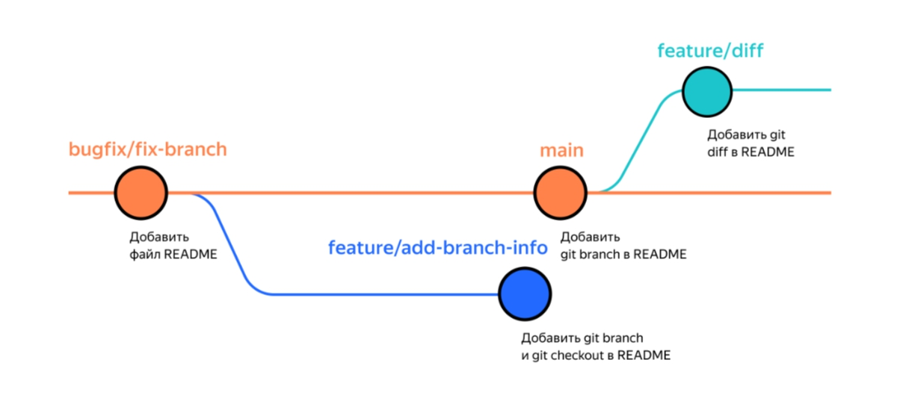
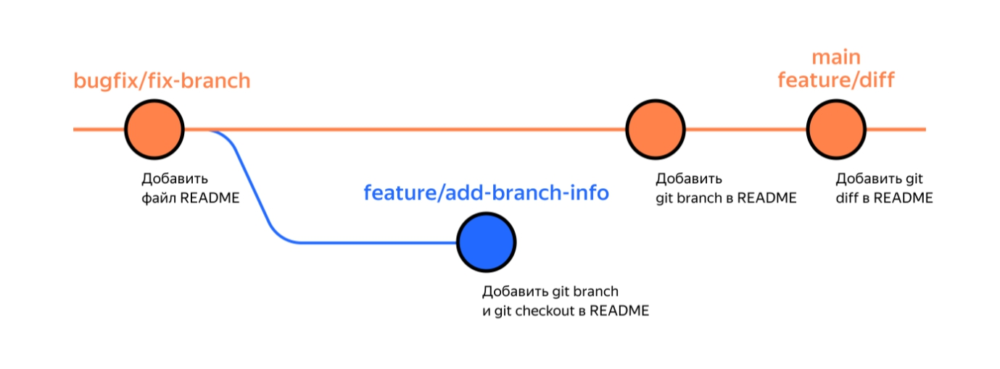
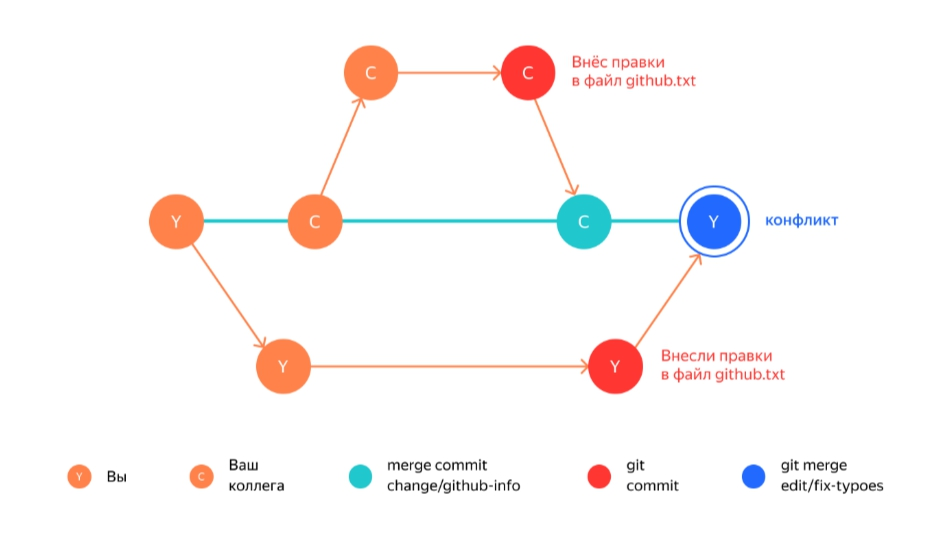

# Слияние и удаление веток  

__*Тема 4/6 (Слияние и удаление веток) - Урок 1/3*__  

# Объединяем и удаляем ветки  

Представьте, что закончили разработку новой функциональности в отдельной ветке и готовы объединить её с главной — добавить свои изменения в основную версию проекта. Этот процесс называется __слиянием веток__.  

В этом уроке разберём, как __«мёржить»__ (от англ. *merge* — «сливать», «поглощать») ветки, то есть объединять их. А также как удалять ненужные ветки из репозитория.  

## Выполнить слияние — `git merge <название_ветки>`  

Откройте проект `git-branches` из предыдущей темы. Напомним, что сейчас состояние репозитория следующее.  
  

Перед тем как начать процесс слияния, нужно перейти в ветку, куда должны добавиться изменения. Обычно это главная ветка. Перейдите в неё и вызовите команду `git merge` с именем присоединяемой ветки `feature/diff` в качестве параметра.  

```text
$ git checkout main # переключились на главную ветку

$ git merge feature/diff # объединили ветки
Updating 079cfbf..f30d441
Fast-forward
 README.md | 2 ++
 1 file changed, 2 insertions(+) 
```

Объединение веток прошло успешно! Все коммиты из `feature/diff` добавлены в главную ветку. В сообщении после слияния содержится следующая информация:  

- `Updating 079cfbf..f30d441` — значит, что коммиты c `079cfbf` по `f30d441` были объединены.  
- `Fast-forward` — это режим слияния. `Fast-forward` (англ. «перемотка») значит, что итогом слияния будет линейная история коммитов. Такое происходит, когда истории двух веток находятся на одной прямой — то есть когда одна ветка продолжает историю, начатую другой, как в нашем примере.  
- Информация о конкретных изменениях. В нашем примере поменялся файл `README.md` (`1 file changed`): в нём теперь две новые строки (`2 insertions(+)`).  

После слияния веток `main` и `feature/diff` репозиторий перейдёт в следующее состояние.  
  

Основная ветка и `feature/diff` теперь указывают на один коммит. Вы можете проверить это с помощью `git log --oneline`.  

```text
$ git log --oneline

f30d441 (HEAD -> main, feature/diff) Добавить описание git diff в README
079cfbf Добавить git branch в README.
7ad18bd Добавить файл README 
```

Откройте файл `README.md` и убедитесь, что теперь он содержит информацию из обеих веток.  

## Удалить ветку после объединения — `git branch -D <название_ветки>`  

После того как произошло слияние, ветку-донора можно удалить. Для этого в основной ветке введите команду `git branch` с флагом `-D` (от англ. *delete* — «удалить») и названием ветки.  

```text
$ git branch # проверяем местоположение
  bugfix/fix-branch
  feature/add-branch-info
  feature/diff
* main

$ git checkout main # если не в основной, переходим в неё

$ git branch -D feature/diff # удаляем поглощаемую ветку
Deleted branch feature/diff (was f30d441). 
```

Ветка `feature/diff` удалена — об этом говорит сообщение `Deleted branch feature/diff`.  

> ⚠️ Если в момент удаления вы будете находиться в той ветке, которую хотите удалить, Git сообщит об ошибке: `can not delete branch` (англ. «не получается удалить ветку»).  

У команды `git branch -D` есть более безопасный вариант с флагом `-d`. Он удалит ветку только если она была полностью объединена с другой — то есть если две ветки стали (или изначально были) частью одной истории. Например, если вы нечаянно создали ветку с неправильным названием, её можно удалить через `git branch -d %имя_ветки%`.  

> ⚠️ Удаление локальной ветки через Git не удаляет ветку на GitHub!  

## Задание для самостоятельной работы  

1. Попрактикуйтесь в слиянии веток: создайте новый проект `merge-project` и сделайте его Git-репозиторием.  
2. В репозитории создайте файл `README.md` и добавьте в него строку.  

```text
 Это первая строка.
```

 Затем выполните коммит с сообщением `"Создать README.md"`.
3. Создайте новую ветку `feature/new-line` и перейдите в неё.  
4. Добавьте ещё одну строку в `README.md`, чтобы файл получился таким.  

```text
 Это первая строка.
 Это вторая строка.
```

 Затем выполните коммит с сообщением `"Добавить новую строку в README.md"`.  
5. Проверьте, что теперь в вашем проекте есть два коммита (у вас хеши могут отличаться).  

```text
 $ git log --oneline
 
 c2d7fbf (HEAD -> feature/new-line) Добавить новую строку в README.md
 e7163de (main) Создать README.md
```

6. Пришло время объединить ветки! Перейдите в основную ветку и добавьте в неё изменения из `feature/new-line` с помощью `git merge`. Убедитесь что слияние произошло в режиме `fast-forward`, потому что ветки являются частью одной истории.  
7. Снова выведите `git log`, чтобы проверить, объединились ли ветки. Сейчас указатель `HEAD` должен указывать на основную ветку и на `feature/new-line`.  

```text
 $ git log --oneline
 
 c2d7fbf (HEAD -> main, feature/new-line) Добавить новую строку в README.md
 e7163de Создать README.md
```
  
__Что важно запомнить:__

- Выполнить слияние веток позволяет команда `git merge <название_ветки>`. В качестве параметра указывают название ветки, которую нужно влить в текущую.  
- Удалять ненужные ветки после слияния — хорошая практика. Так в вашем репозитории всегда будет порядок. За удаление веток отвечает команда `git branch -D <название_ветки>` и её щадящий вариант с флагом `-d`.

---

__*Тема 4/6 (Слияние и удаление веток) - Урок 2/3*__  

## Что такое конфликт  

Когда сразу несколько членов команды работают над одним и тем же фрагментом проекта в разных ветках, при слиянии могут происходить конфликты. Рассмотрим, как это бывает и что делать в такой ситуации.  

## Знакомьтесь: конфликт  

Допустим, вы решили отредактировать параграф текста и исправить опечатки. В этот момент ваш коллега поменял тот же самый параграф в соседней ветке `change/github-info` и влил изменения в `main`.  
После завершения работы вы делаете финальный коммит в своей ветке `edit/fix-typoes`, переходите в основную и пытаетесь выполнить слияние. Но в терминале появляется такое сообщение.  

```text
$ git commit -m "Исправить опечатки" && git checkout main
$ git merge edit/fix-typoes
Auto-merging pages/table-of-content.txt # тут Git самостоятельно внёс изменения 
CONFLICT (content): Merge conflict in github.txt # здесь возник конфликт
Automatic merge failed; fix conflicts and then commit the result # слияния не произошло 
```

На схеме эта ситуация может выглядеть так.  


Если Git не может провести слияние изменений автоматически, он сообщает о __конфликте__. Конфликт — это ситуация, в которой один или несколько человек модифицировали один и тот же файл. При этом результаты таких модификаций оказались несовместимы и разобраться в том, какой из вариантов правильный, может только человек.  
В разработке, например, конфликты чаще всего возникают, когда несколько программистов одновременно меняют код в одном и том же месте.  

## Как разрешать конфликты: общие рекомендации  

Во время слияния Git сам подсвечивает файлы, которые не смог объединить. Чтобы разобраться в ситуации, нужно сделать следующее:  

1. Заглянуть в файл, где произошёл конфликт.  
2. Изучить обе стороны конфликта — вашу версию и версию вашего коллеги. Ваша задача — правильно собрать две версии в итоговую, так чтобы изменения обеих сторон не потерялись. Новая версия станет текущей актуальной.  
3. Вручную удалить или подправить неактуальные изменения, если они есть.  
4. Подготовить изменения к сохранению и сделать коммит.  

Подробнее о том, как работать с конфликтами, мы ещё расскажем дальше в курсе. Также узнать об этом больше можно из официальной документации Git.  

---
