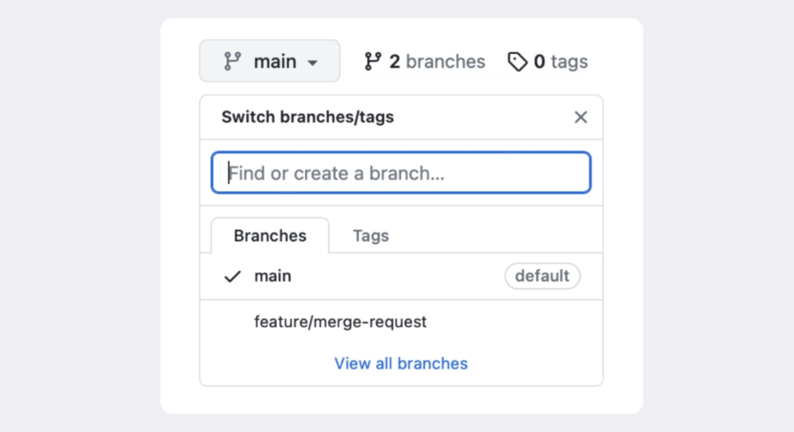
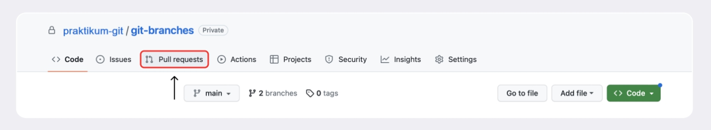
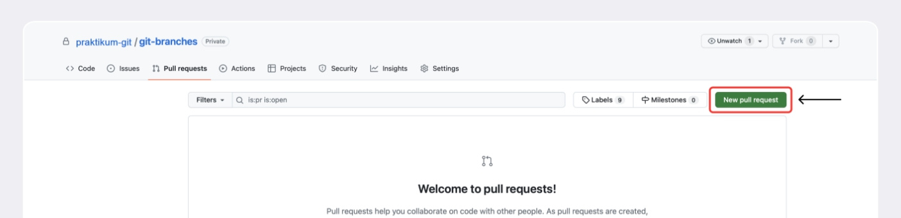
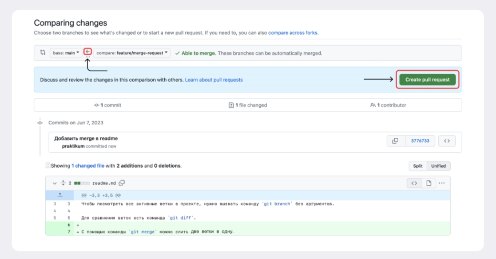

# Работа с ветками в удалённом репозитории  

__*Тема 5/6 (Работа с ветками в удалённом репозитории) - Урок 1/4*__  

##   Отправить локальную ветку в удалённый репозиторий — `git push`  

Создайте на GitHub репозиторий с именем `git-branches` — в него вы загрузите локальный проект `git-branches` из предыдущих уроков. Для этого откройте вашу страницу на GitHub по ссылке `https://github.com/username`, где `username` — имя пользователя, которое было указано при регистрации.  

Перейдите на вкладку __Repositories__ (англ. «репозитории») и нажмите кнопку __New__ (англ. «новый»).  

Введите название нового репозитория (`git-branches`) и сделайте его __приватным__ (англ. *Private*), то есть доступным только вам. Затем нажмите __Create repository__ (англ. «создать репозиторий»).  

Откройте консоль, перейдите в проект `git-branches` и привяжите удалённый репозиторий к локальному с помощью команды `git remote add origin git@github.com:%ИМЯ_АККАУНТА%/git-branches.git` (от англ. *remote* — «удалённый» и *add* — «добавить»). В качестве параметров указываются имя удалённого репозитория (`origin`) и его URL.  

Убедитесь, что находитесь в основной ветке, и выполните команду `git push` с флагом `-u`, который свяжет локальную ветку с удалённой. Также команде нужно передать параметры `origin` и имя текущей ветки.  

```text
$ git push -u origin main 
#
```

Поскольку команда для отправки локальной ветки в удалённый репозиторий называется `push`, разработчики так и говорят — __«запушить»__.  

Отлично! Теперь основная ветка появится на GitHub.  

Теперь убедитесь, что вы находитесь в основной ветке. Если нет, перейдите в неё через `git checkout main` (`git checkout master`), а затем создайте новую ветку `feature/merge-request` и перейдите в неё (`git checkout feature/merge-request`). Откройте файл `README.md` и добавьте туда строку о команде `git merge`.  

```text
# Ветки в Git 

Чтобы посмотреть все активные ветки в проекте, нужно вызвать команду `git branch` без аргументов. 

Для сравнения веток есть команда `git diff`.

С помощью команды `git merge` можно слить две ветки в одну. 
```

Добавьте изменения в `staging area` и сделайте коммит с сообщением: `git add . && git commit -m "Добавить merge в README"`.  

Вернитесь в локальный проект. Чтобы отправить `feature/merge-request` в удалённый репозиторий, необходимо ещё раз выполнить команду `push`. Обратите внимание: теперь необязательно переходить в ветку, чтобы запушить её.  

```text
$ git push -u origin feature/merge-request 
#
```

В консоль будет выведено следующее сообщение.  

```text
$ git push -u origin feature/merge-request
Total 0 (delta 0), reused 0 (delta 0), pack-reused 0
remote: 
remote: Create a pull request for 'feature/merge-request' on GitHub by visiting:
remote:      https://github.com/%ВАШ_АККАУНТ%/git-branches/pull/new/feature/merge-request
remote: 
To github.com:%ВАШ_АККАУНТ%/git-branches.git
 * [new branch]      feature/merge-request -> feature/merge-request
branch 'feature/merge-request' set up to track 'origin/feature/merge-request'. 
```

Это сообщение состоит из трёх частей:  

- `Total 0 (delta 0), reused 0 (delta 0), pack-reused 0` — говорит, сколько файлов было загружено. Обычно эта информация не имеет особого значения.  
- `Create a pull request for 'feature/merge-request' on GitHub by visiting:` — предоставляет ссылку, чтобы быстро создать запрос на изменения. Подробнее о таких запросах расскажем в следующем уроке.  
- `* [new branch]      feature/merge-request -> feature/merge-request` — показывает, что в результате операции в удалённом репозитории была создана новая ветка `feature/merge-request`, на которую теперь ссылается локальная ветка `feature/merge-request`.  

Откройте GitHub и обновите страницу. После добавления новой ветки произойдёт два события:  

- вместо `1 branch` (англ. «одна ветка») станет `2 branches` (англ. «две ветки»);  
- по клику на список веток теперь можно перейти в ветку `feature/merge-request`.


---

__*Тема 5/6 (Работа с ветками в удалённом репозитории) - Урок 2/4*__  

## Создаём *pull request*  

В процессе командной работы следует внимательно следить за изменениями в файлах. Нельзя просто внести правки в своей ветке и сразу залить её в основную. Сначала ваши коллеги должны убедиться, что предложенные вами изменения логичны и эффективны.  

Для этого используют механизм __pull request__ (англ. «запрос на изменения»; буквально: «запрос на подтягивание»). В обиходе его обычно так и называют — «пул-реквест», или ещё короче — ПР или PR. Алгоритм такой:  

1. Вы трудитесь над задачей в своей ветке — например, пишете код новой функциональности.  
2. Вы заканчиваете работу, а затем создаёте пул-реквест.  
3. Ваши коллеги проверяют, что код выглядит аккуратно и лаконично, а программа работает корректно; также оставляют комментарии. Этот процесс называют __code review__ (англ. «рассмотрение кода»), или просто __ревью__.  
4. После финального согласования вы заливаете свою ветку в основную.  

## Из чего состоит *pull request* и чем он может обернуться  

У каждого пул-реквеста есть:  

- __Название__ — краткое описание предлагаемых изменений. Например: `Адаптивный заголовок сайта`, `Замена альбома на галерею` и так далее.  
- __Описание__ — развёрнутое описание изменений. Это поле заполнять необязательно, но желательно.  
- __Исходная ветка__ — та, в которой вы работали. Например, `feature/merge-request`.  
- __Целевая ветка__ — основная ветка проекта, в которую вы хотите внести изменения.  

Где заполнять эти параметры, вы увидите далее — в ходе тренировки. Также у каждого пул-реквеста может быть два исхода:  

- __merge__ (англ. «соединить») — предлагаемые изменения приняты; код вливается в целевую ветку; пул-реквест закрывается.  
- __close__ (англ. «закрыть») — пул-реквест закрывается без слияния изменений.  

> 💡 [Вот тут](https://github.com/yandex/ym-helpers/pull/14) можно посмотреть, как разработчики обсуждают изменения кода в комментариях к пул-реквесту.  

## Делаем *pull request*  

После того как новая ветка «запушена» в удалённый репозиторий, можно делать пул-реквест. Существует два способа.  

__Первый способ__. При создании новой ветки в удалённом репозитории Git распечатает сообщение. Оно включает ссылку на создание пул-реквеста.  

```text
remote: Create a pull request for 'feat/diff' on GitHub by visiting:
remote:      https://github.com/%ВАШ_АККАУНТ%/git-branches/pull/new/feature/merge-request 
```

Останется только скопировать её в адресную строку браузера, заполнить необходимые поля и нажать __Create pull request__ (англ. «создать запрос на изменения»). Многие терминалы также позволяют кликнуть на эту ссылку — напрямую или через комбинацию __Cmd / Ctrl + клик__.  

Однако такая ссылка появляется __только один раз__ и для новых веток, поэтому иногда приходится идти более сложным путём.  

__Второй способ__. Чтобы создать пул-реквест для любой существующей ветки на GitHub, перейдите на страницу репозитория, а затем выберите вкладку __Pull requests__ в верхней части экрана.  


Нажмите на зелёную кнопку __New pull request__ (англ. «новый запрос на изменения»).  


Выберите названия веток: ветка «откуда» (из которой будет происходить пул-реквест) и ветка «куда» (в которую он будет осуществлён). В нашем случае изменения должны попасть из ветки `feature/merge-request` в ветку `main`. __На направление изменений указывает стрелка__.  

В окне ниже отобразится несколько коммитов, а также их изменения. Нажмите на кнопку __Create pull request__.  


> 💡 Вы можете создать пул-реквест из любой ветки, которая отличается от `main`. У многих команд разработки две основные ветки. В ветке `dev` ведётся вся активная работа, а в ветке `main` хранится основная рабочая версия. При этом ветка `dev` время от времени сливается с веткой `main`.  

Заполните поля с названием и описанием пул-реквеста. Нажмите __Create pull request__.  

Готово: пул-реквест создан! Теперь вы или ваши коллеги могут перейти на вкладку __Files changed__ (англ. «изменённые файлы»), чтобы оставить свои комментарии — провести ревью.  

По окончании ревью можно посмотреть комментарии и обсудить изменения на вкладке __Pull requests__. Также вы можете в любой момент добавить дополнительные коммиты в ветку — они автоматически попадут в открытый пул-реквест после пуша.  

Осталось только нажать на кнопку __Merge pull request__ (англ. «принять запрос на изменения») — это действие объединит ветку с вашими изменениями и ветку `main`.  

Теперь ваши изменения стали частью основной ветки!  

Теперь ваша работа не останется незамеченной, и в этом поможет пул-реквест:  

- Пул-реквест — это запрос на рассмотрение предлагаемых изменений и часть процесса ревью.  
- Запрос на изменения можно инициировать двумя способами: через ссылку, которую Git выводит после создания ветки, или через интерфейс GitHub.  
- После создания пул-реквеста ваши коллеги сделают ревью — оценят предложенные вами правки и оставят свои комментарии.  
- По результатам ревью ваши правки могут быть приняты в основную ветку проекта или возвращены на доработку.  

---

__*Тема 5/6 (Работа с ветками в удалённом репозитории) - Урок 3/4*__  

# Забираем изменения из удалённого репозитория  

Сейчас вы выполняете задания в одиночку. В реальных проектах всё по-другому: например, над одной программой работают как минимум два разработчика.  
Представьте, что ваш коллега занимался проектом все выходные, а вы пришли в понедельник и хотите опубликовать свои правки, над которыми поработали ещё в пятницу. Однако у проекта уже новая версия — внесённые изменения есть на GitHub и на локальном компьютере коллеги, но не на вашем. В этом уроке покажем, как забрать изменения себе.  

## Забрать изменения из удалённого репозитория — `git pull`  

Чтобы скачать изменения из удалённого репозитория, следует выполнить команду `git pull` (от англ. *pull* — «вытянуть») — стянуть, или «запулить» изменения.  

Алгоритм такой. Сначала нужно перейти в локальный репозиторий и убедиться, что вы находитесь в правильной ветке, — как правило, это основная ветка `main` (или `master`). Затем можно ввести команду.  

```text
$ git pull 
#
```

Обычно `git pull` — это первая команда, которую вводит разработчик, как только открывает код проекта, чтобы начать с ним работать.  

Дополнительно `git pull` и `git merge` выполняют перед тем, как создать __пул-реквест__. При командной работе, особенно в больших командах, основная ветка часто успевает «убежать» вперёд, пока вы подготавливаете свои изменения. Поэтому перед созданием пул-реквеста рекомендуется сначала подтянуть изменения из основной ветки, объединить их с вашей, решить все возможные конфликты и лишь затем сделать `push`.  

```text
$ git checkout main # перешли в main
$ git pull # подтянули новые изменения в main
$ git checkout my-branch # вернулись в рабочую ветку my-branch
$ git merge main # влили main в новую ветку my-branch
$ git push -u origin my-branch # отправили ветку my-branch в удалённый репозиторий 
#
```

__Подытожим__:  

- Команда `git pull` позволяет подтянуть изменения из удалённого репозитория в локальный.  
- Перед созданием нового пул-реквеста считается хорошей практикой перейти в главную ветку, «подтянуть» в неё изменения, а затем добавить эти изменения в вашу ветку с помощью `git merge main`.  

---
