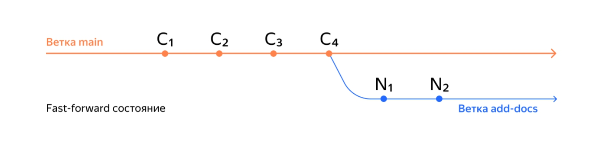
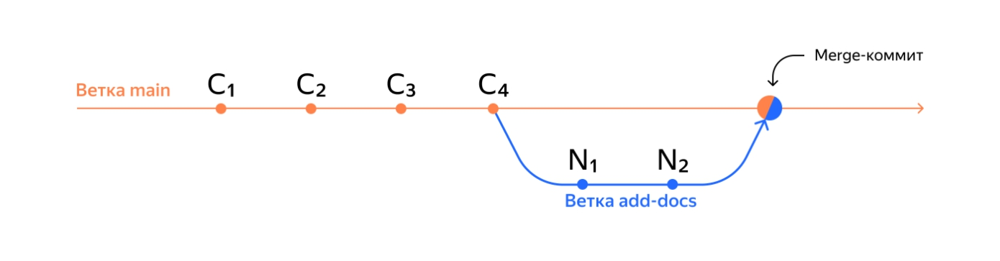
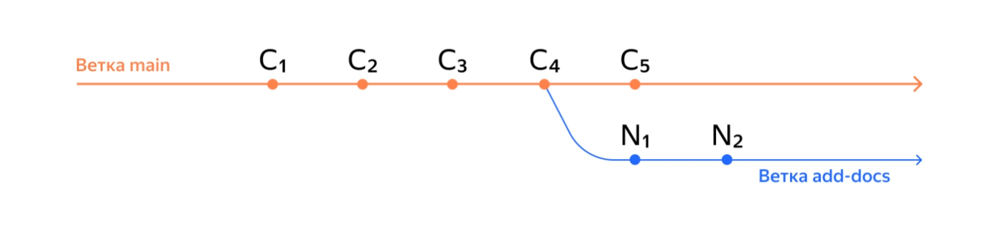
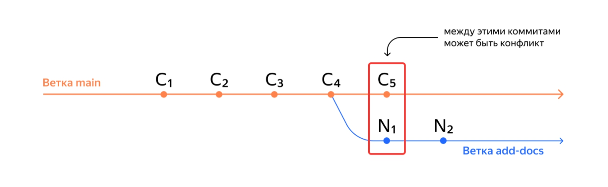
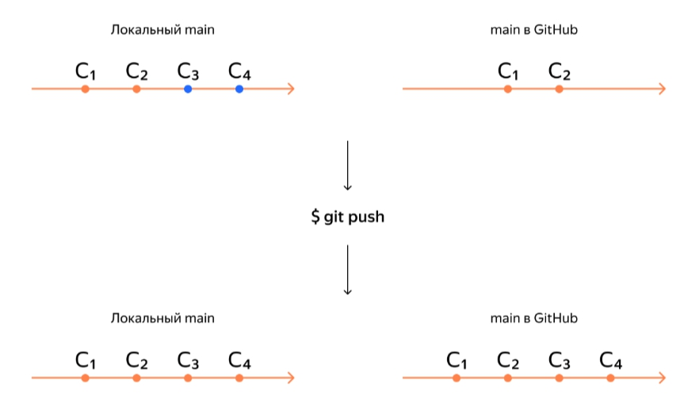
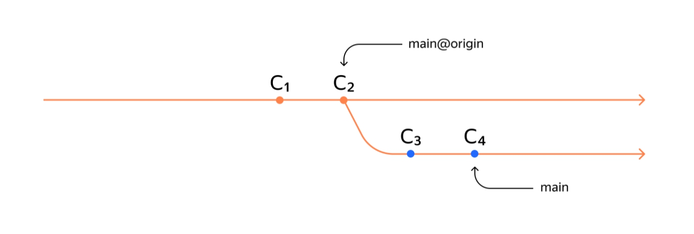
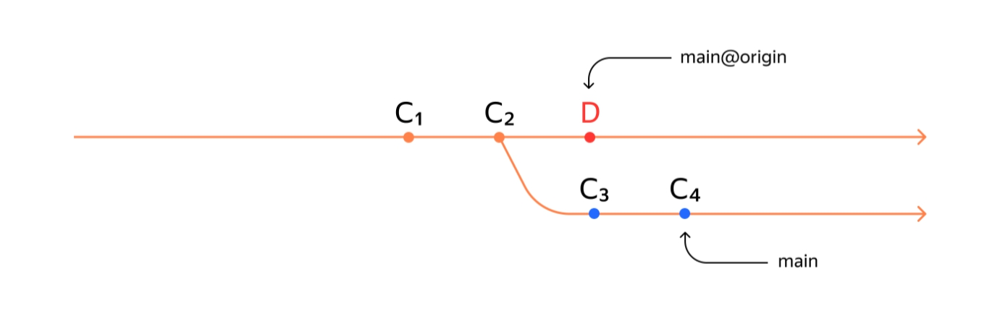
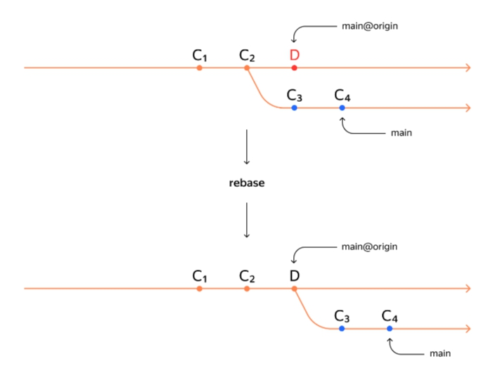
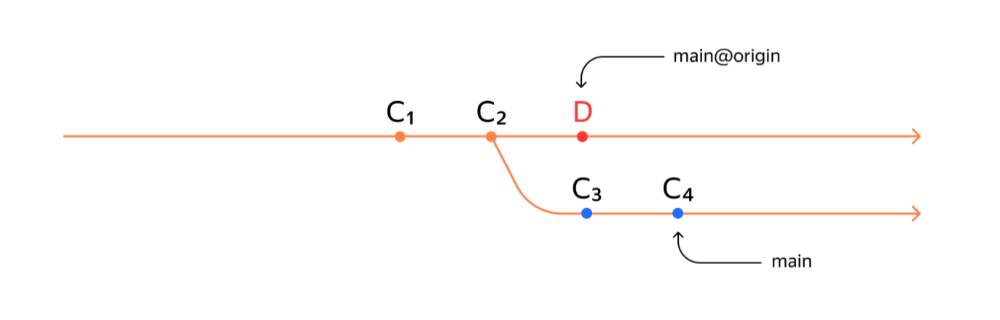

# Работа с ветками на практике  

__*Тема 2/5 (Работа с ветками на практике) - Урок 1/5*__  

## Что такое fast-forward  

В этой теме расскажем о подходах к работе с ветками в команде. А именно: в какой момент создаются ветки, когда они сливаются друг с другом, какие коммиты и в какую ветку попадают.  

Чтобы разобрать плюсы и минусы реально используемых подходов, сначала объясним, чем плох простой и очевидный подход «все дружно „пушим“ в `main` по очереди!». Для этого понадобится рассмотреть понятие __fast-forward__ (англ. «перемотка вперёд») и его связь с `git push`. Начнём с __fast-forward__: что это такое и как его распознать.  

## Состояние *fast-forward*  

Две ветки находятся в состоянии __fast-forward__, если одну из них можно «перемотать» вперёд и она будет содержать те же коммиты, что и другая. Это утверждение можно сформулировать иначе:  

- при слиянии этих двух веток никак не возможен конфликт;  
- истории этих двух веток не «разошлись»;  
- одна ветка является продолжением другой.  

Хотя все эти условия звучат по-разному, они значат одно и то же.  

Разберём на примере. Есть две ветки: `main` и `add-docs` (англ. «добавить документацию»). В ветке `main` четыре коммита, от неё создали ветку `add-docs` и добавили в неё ещё два коммита.  

```text
$ git branch
* add-docs
  main

$ git log --oneline
e08fa2a (HEAD -> add-docs) New docs 2
fd588b2 New docs 1
997d9ce (main) Commit 4
0313e8e Commit 3
5848aba Commit 2
04923d7 Commit 1 
```

Схематически можно изобразить ветки main и add-docs так.


Ветка `add-docs` «обгоняет» ветку `main` на два коммита: __N1__ и __N2__ (в нашем примере с кодом они называются `New docs 1` и `New docs 2`).  

Допустим, мы хотим влить ветку `add-docs` в `main`. При этом все коммиты из `add-docs` можно просто «положить» в `main`, и они выстроятся за уже существующими.  

Результат слияния будет выглядеть так.  

```text
$ git checkout main
$ git merge add-docs
Updating 997d9ce..e08fa2a
Fast-forward
 docs.txt | 1 +
 1 file changed, 1 insertion(+)
 create mode 100644 docs.txt

$ git log --oneline
e08fa2a (HEAD -> main, add-docs) New docs 2
fd588b2 New docs 1
997d9ce Commit 4
0313e8e Commit 3
5848aba Commit 2
04923d7 Commit 1 
```

Обратите внимание на два момента:  

- При слиянии веток Git выводит строку `Fast-forward`.  
- В истории коммитов `HEAD` указывает одновременно и на `main`, и на `add-docs`. После такого слияния эти ветки одинаковые: в них одни и те же коммиты.  

Схематически результат слияния веток выглядит так.  


Git просто добавил коммиты из `add-docs` в ветку `main`, или перемотал `main` вперёд до состояния `add-docs`. Отсюда и название «перемотка».  

## Можно ли отключить *fast-forward*  

__Fast-forward__ слияние веток можно отключить флагом `--no-ff`. Например: `git merge --no-ff add-docs`. Также его можно отключить «навсегда» (до тех пор, пока вы не вернёте настройку «как было») с помощью настройки `merge.ff`: `git config [--global] merge.ff false`.  

Если отключить слияние в режиме `fast-forward`, вместо «перемотки» ветки Git создаст в ней __коммит слияния__ (англ. *merge commit*) — в обиходе его называют __merge-коммит__ или __мёрж-коммит__. В этом случае результат «вливания» ветки `add-docs` в `main` выглядел бы так.  

```text
# находимся в ветке main
# --no-edit отключает ввод сообщения для merge-коммита
# --no-ff отключает fast-forward слияние веток
$ git merge --no-edit --no-ff add-docs
Merge made by the 'ort' strategy.
 docs.txt | 1 +
 1 file changed, 1 insertion(+)
 create mode 100644 docs.txt

# с флагом --graph
# Git нарисует ветки с помощью «палочек» и «звёздочек»
# получившийся коммит слияния: 6814789
$ git log --graph --oneline
*   6814789 (HEAD -> main) Merge branch 'add-docs'
|\
| * e08fa2a (add-docs) New docs 2
| * fd588b2 New docs 1
|/
* 997d9ce Commit 4
* 0313e8e Commit 3
* 5848aba Commit 2
* 04923d7 Commit 1 
```

На схеме результат слияния будет таким.


> 💡 Зачем отключать fast-forward?  
>Многие проекты отключают *fast-forward* слияние веток, потому что при нём теряется часть информации. Результат выглядит так, как будто в `main` «просто появились» новые коммиты. Если не знать о ветке `add-docs`, то можно подумать, что такой ветки и не было.  
> Полноценный коммит слияния сохраняет всю информацию: в нём будет указано, какая именно ветка вливалась в `main`.  

Итак:  

- Если истории двух веток не «разошлись» и их коммиты выстраиваются в одну цепочку, эти ветки можно объединить в режиме __fast-forward__.  
- Режим __fast-forward__ можно отключить с помощью флага `--no-ff`.  

---

__*Тема 2/5 (Работа с ветками на практике) - Урок 1/5*__  

## *Non-fast-forward*  

В прошлом уроке вы поближе познакомились с состоянием *fast-forward*. Теперь покажем, что происходит при объединении двух веток, коммиты которых нельзя выстроить в одну цепочку.  

## Состояние *non-fast-forward*  

Вернёмся к примеру с ветками `main` и `add-docs` и представим такую ситуацию: истории двух веток «разошлись». Это значит, что их коммиты уже нельзя выстроить в одну линию.  

Например, после «отделения» `add-docs` в ветку `main` добавили новый коммит `Commit 5`.  

```text
# команде git log можно указать несколько веток,
# и тогда она выведет их все
$ git log --graph --oneline main add-docs
* 15d3f04 (HEAD -> main) Commit 5
| * 8de42eb (add-docs) New docs 2
| * 4d3c346 New docs 1
|/
* 73def1e Commit 4
* 9c30ab3 Commit 3
* 83cc5ec Commit 2
* 8e87fb2 Commit 1 
```

На схеме это будет выглядеть так.  


Теперь просто «положить» все коммиты из `add-docs` в `main` не получится. Например, коммит __C5__ из `main` может конфликтовать с каким-нибудь коммитом из ветки `add-docs` (__N1__ или с __N2__; на схеме ниже мы выбрали __N1__ в качестве примера). То есть содержать изменения в тех же файлах (и в тех же строках), что и коммит __C5__.  


> ⚠️ Когда Git проверяет ветки на состояние *fast-forward*, он не «заглядывает» в файлы и не пытается угадать, будет ли конфликт на самом деле. Для Git важно только, что конфликт теоретически возможен (или, наоборот, никак не возможен).  

При слиянии __не-fast-forward__ веток Git создаёт __коммит слияния__.  

```text
# находимся в ветке main
# --no-edit избавляет от необходимости
# вводить сообщение для merge-коммита
$ git merge --no-edit add-docs
Merge made by the 'ort' strategy.
 docs.txt | 1 +
 1 file changed, 1 insertion(+)
 create mode 100644 docs.txt

# коммит слияния: 34f5f8f
$ git log --graph --oneline
*   34f5f8f (HEAD -> main) Merge branch 'add-docs'
|\
| * 8de42eb (add-docs) New docs 2
| * 4d3c346 New docs 1
* | 15d3f04 Commit 5
|/
* 73def1e Commit 4
* 9c30ab3 Commit 3
* 83cc5ec Commit 2
* 8e87fb2 Commit 1 
```

На схеме это будет выглядеть так.  


Если конфликтов при слиянии нет, команда `git merge` отработает почти автоматически — только предложит вам ввести сообщение для нового __коммита слияния__.  

> 💡 Чаще всего сообщения к коммитам слияния не редактируют и оставляют «как предложил Git». Для таких случаев удобен флаг `--no-edit`: `git merge --no-edit %another_branch%`.  

Если конфликты всё-таки есть, Git сначала попытается разрешить их автоматически. Если не получится, Git предложит вам разрешить их вручную. Как разрешать конфликты и какие для этого есть инструменты, мы покажем в следующих уроках модуля.

*Коротко подытожим*:  

- Если истории двух веток всё же «разошлись», при слиянии веток Git создаст коммит слияния.  
- При объединении веток в состоянии __не-fast-forward__ возможны (но не обязательны) конфликты. Если конфликты всё же возникли, Git попытается разрешить их самостоятельно или попросит вас сделать это вручную.  

---

__*Тема 2/5 (Работа с ветками на практике) - Урок 3/5*__  

## Напомним про `git push`  

Коротко напомним, что делает команда `git push`: она «толкает» коммиты из локальной ветки в её удалённую копию.  

Допустим, вы находитесь в ветке `main` в локальном репозитории и выполняете `git push`. В результате __все новые коммиты из локальной__ ветки `main` попадут в ветку `main` в __репозитории на GitHub__. После этого локальная и удалённая ветки будут содержать __одни и те же__ коммиты.  

Хотя `git push` не выполняет слияния веток, для этой команды тоже важно состояние __fast-forward__, но специфическое: между локальной веткой (откуда берутся коммиты для `push`) и удалённой (куда эти коммиты попадут).  

> ⚠️ Обычно локальная и удалённая ветки называются одинаково. Чтобы их различать, мы будем называть локальные ветки просто именем (например, `main`), а удалённые — с суффиксом `@origin` (например, `main@origin`).  
>
>Ветка `main` находится на локальном компьютере, а `main@origin` — в репозитории на GitHub.  

Если `main` и `main@origin` находятся между собой в состоянии `fast-forward` (`main@origin` можно просто «перемотать» до того же состояния, что и `main`), то `git push` так и сделает. В итоге локальная и удалённая ветки будут содержать одинаковый набор коммитов.  


Ветки `main` и `main@origin` можно нарисовать на одной схеме, потому что локальные коммиты идентичны удалённым. В таком случае схема будет похожа на схемы из предыдущих уроков.  


## `git push` и *не-fast-forward*  

Представим, что ветки `main` и `main@origin` находятся в таком состоянии: в ветке `main@origin` есть коммиты __C1__, __C2__ и D, а в `main` — __C1__, __C2__, __C3__, __C4__.  


Ветки `main` и `main@origin` «разошлись», то есть находятся в состоянии __не-fast-forward__. Если теперь попытаться выполнить команду `git push`, она выведет следующую ошибку.  

```text
# текущая ветка — main
$ git push
To github.com:username/repository.git
 ! [rejected]        main -> main (non-fast-forward)
error: failed to push some refs to 'github.com:username/repository.git'
hint: Updates were rejected because the tip of your current branch is behind
hint: its remote counterpart. Integrate the remote changes (e.g.
hint: 'git pull ...') before pushing again.
hint: See the 'Note about fast-forwards' in 'git push --help' for details. 
```

Обратите внимание на надписи `rejected` (англ. «запрос отклонён») и `non-fast-forward` — Git подсказывает, что именно пошло не так.  

## Пара слов о *rebase*  

В Git можно решить проблему «разошедшихся» веток с помощью операции __rebase__ (англ. «перебазирование»). Эта операция позволяет изменить точку (коммит), от которой отделилась ветка. Результат перебазирования ветки `main` c коммита __C2__ на коммит __D__ можно увидеть на схеме.  


После такого перебазирования ветки будут в состоянии `fast-forward`, и `git push` сработает без ошибок. Однако у такого шага могут быть последствия. Например:  

- могут возникать конфликты между изменениями, как при слиянии веток;  
- если действовать неаккуратно, можно __«сломать»__ репозиторий.  

И всё же это мощный инструмент, который поможет во многих сложных ситуациях. Подробнее об операции перебазирования мы ещё расскажем в курсе.  

## Пара слов о `git push --force`  

Есть и другой способ справиться с ошибкой `rejected: non-fast-forward` — это форсированный пуш. Чтобы его выполнить, используют флаг `--force` (англ. «сила», «заставить»).  

Вернёмся к примеру с «разошедшимися» ветками `main` и `main@origin`.  


В этом случае команда `git push --force` просто «выкинет» (удалит) коммит __D__ и запишет в `main@origin` коммиты из `main`. Вот что получится.  


Коммит __D__ просто исчез!  

> 💡 В очень редких случаях это уместная команда. Например, если кто-то нечаянно «сломал» ветку `main@origin`, можно найти копию репозитория, в которой ветка `main` не «сломана», и использовать `git push --force` для восстановления ветки в `origin`.  

---

