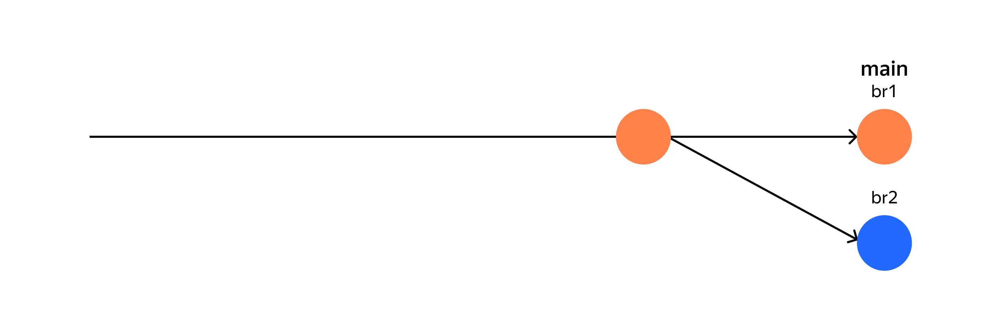
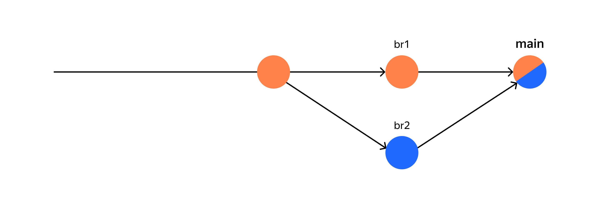
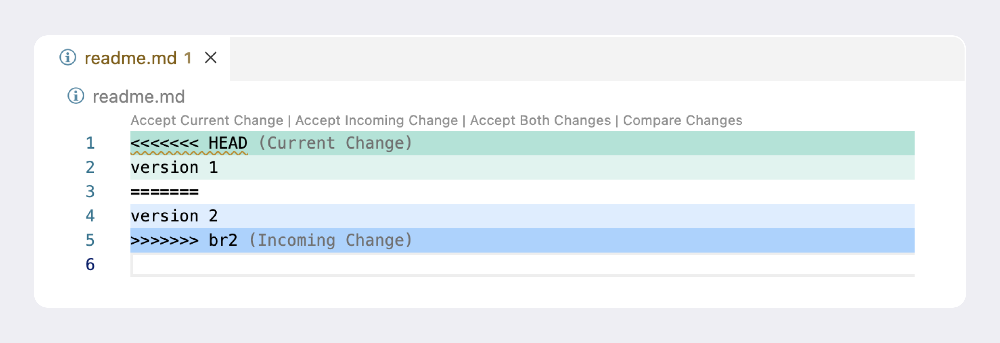
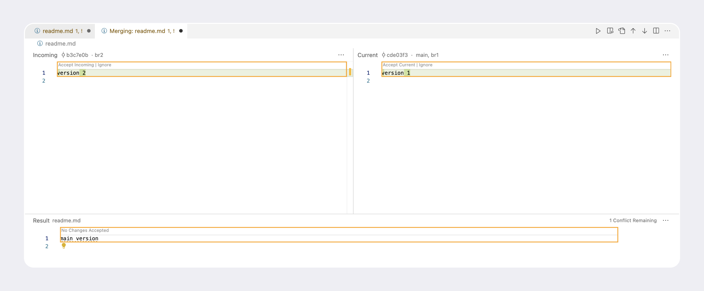
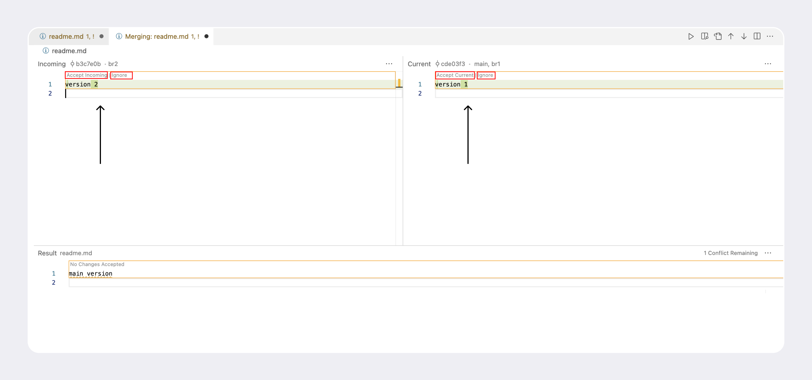
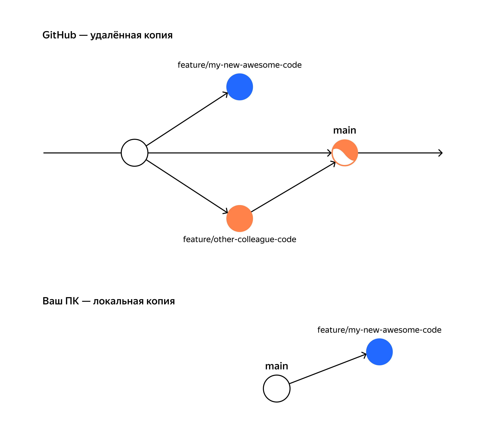
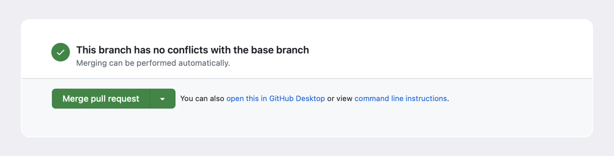
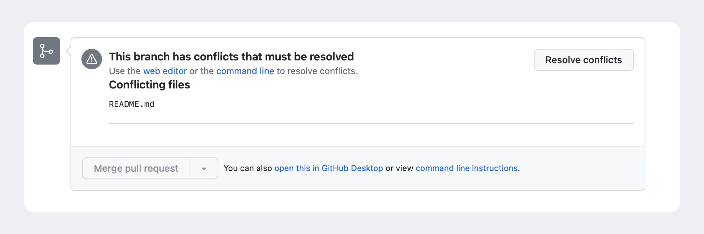
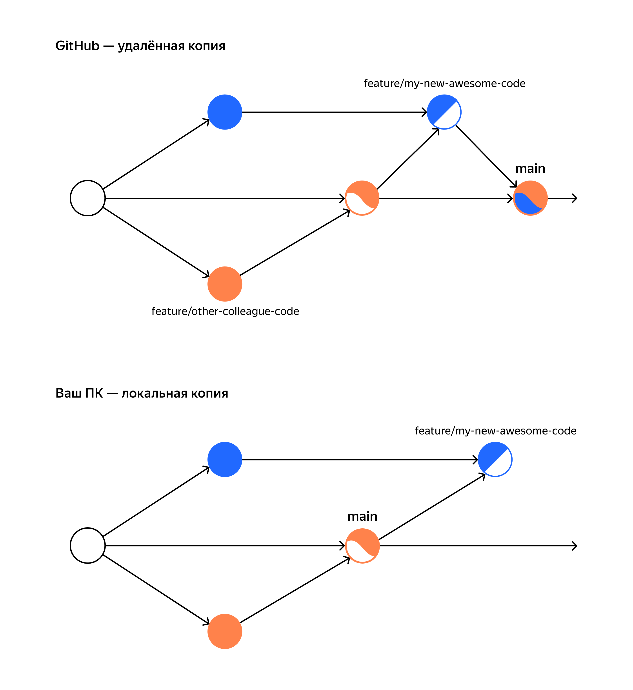

# Конфликты  

__*Тема 4/5 (Конфликты) - Урок 1/3*__  

## Разрешение конфликта вручную и через `vimdiff`  

В этой теме поговорим о конфликтах слияния. Они могут случиться при слиянии веток (`merge`), если один и тот же файл был изменён в обеих ветках. Git не может сам решить, какая версия файла «правильная», а какая нет.  

Такие конфликты нередко возникают в командной работе. В этом уроке покажем, как разрешать их вручную и через консоль.  

## Подготавливаем репозиторий и создаём конфликт  

Подготовьте новый Git-репозиторий с помощью следующего набора команд:  

```text
$ mkdir git-conflict && cd git-conflict && git init
# создаём папку, переходим в неё, инициализируем новый Git-репозиторий

$ echo 'main version' > readme.md && git add . && git commit -m 'main'
# добавляем текст 'main version' в файл readme.md, делаем коммит

$ git checkout -b br1 && echo 'version 1' > readme.md && git add . && git commit -m 'v1'
# переходим в ветку br1 из основной ветки. Изменяем текст на 'version 1', делаем коммит

$ git checkout main
# возвращаемся в основную ветку

$ git checkout -b br2 && echo 'version 2' > readme.md && git add . && git commit -m 'v2'
# переходим в ветку br2 из основной ветки. Изменяем текст на 'version 2', делаем коммит 
```

__То же самое одной командой — скопируйте и вставьте в консоль.__

Обратите внимание: все команды объединены через символ `&&`, а строки — через слеш (`\`). Слеш в конце консольной команды позволяет продлить её на следующую строку.  
В примере мы используем ветку `mai`n как основную. Возможно, вам понадобится поменять её на `master`.  

```text
mkdir git-conflict && cd git-conflict && git init && \
echo 'main version' > readme.md && git add . && git commit -m 'main' && \
git checkout -b br1 && echo 'version 1' > readme.md && git add . && git commit -m 'v1' && \
git checkout main && \
git checkout -b br2 && echo 'version 2' > readme.md && git add . && git commit -m 'v2' 
```

После выполнения этих команд будет создан репозиторий с тремя коммитами: первый добавляет текст `main version`, а два других — текст `version 1` и `version 2`. Обе ветки отходят от `main` и изменяют один и тот же файл. При попытке объединить все три ветки получится конфликт.  


Добавьте в основную ветку (`main` или `master`) ветку `br1`. Коммиты этих веток можно выстроить в одну линию, поэтому слияние будет выполнено в режиме `fast-forward`.  

```text
$ git checkout main && git merge br1
# ваша основная ветка может называться master

Updating 5f57121..c354ae5
Fast-forward
 readme.md | 2 +-
 1 file changed, 1 insertion(+), 1 deletion(-) 
```

Теперь в файле `readme.md` содержится текст `version 1`, а текущее состояние веток будет такое.  


Настало время создать конфликт! Для этого убедитесь, __что находитесь в основной ветке__, а затем выполните `git merge`.  

```text
$ git checkout main && git merge br2
# ваша основная ветка может называться master

Auto-merging readme.md
CONFLICT (content): Merge conflict in readme.md
Automatic merge failed; fix conflicts and then commit the result. 
```

Поздравляем: конфликт получен!  

## Разрешаем конфликт вручную  

Когда Git выявляет конфликт, он помечает проблемные файлы и останавливает процесс слияния.  

> 💡 Если выполнить `git status` в процессе *«мёржа»*, файлы с маркерами конфликтов будут отображаться в особой категории `Unmerged paths` (англ. «не соединённые пути») с текстом `both modified` (англ. «оба изменены»). Вывод будет такой.  
>
>```text
>$ git status
>
>On branch main
>You have unmerged paths.
>  (fix conflicts and run "git commit")
>  (use "git merge --abort" to abort the merge)
>
>Unmerged paths:
>  (use "git add <file>..." to mark resolution)
>    both modified:   readme.md 
>```

При попытке объединить ветки или применить изменения из удалённого репозитория Git добавит в файлы специальные маркеры конфликта. Убедитесь в этом. Откройте файл `readme.md` в графическом интерфейсе или выполните `cat readme.md`. Вы увидите следующее.  

```text
$ cat readme.md   

<<<<<<< HEAD
version 1
=======
version 2
>>>>>>> br2 
```

Git разметил файл. Получившиеся секции содержат изменения из каждой ветки:  

- Текст между `<<<<<<< HEAD` и `=======` указывает на изменения, которые находятся в `HEAD` — в данном случае это ветка `main`. Здесь окажутся только те строки, в которых есть конфликт.  
- Текст между `=======` и `>>>>>>> br2` показывает на изменения, которые находятся в ветке `br2`.  

Чтобы разрешить конфликт вручную, нужно открыть файл и выбрать, какие изменения оставить, а какие отбросить. Для этого следует удалить все маркеры и ненужные изменения и оставить нужные. После разрешения конфликта файлы будут отмечены как решённые. Можно продолжить процесс слияния или выполнить коммит изменений.  

Допустим, нужно оставить текст `version 2`. Откройте файл `readme.md` и удалите все маркеры конфликтов, а также строку `version 1`. Должно получиться следующее:  

```text
version 2 
```

Подготовьте изменения к сохранению и сделайте коммит.  

```text
$ git add . && git commit --no-edit 
#
```

Готово! Вы разрешили конфликт вручную и создали коммит слияния. Теперь в файле `readme.md` содержится текст `version 2`. Дерево коммитов будет выглядеть так.  


## Разрешаем конфликт через инструмент слияния `vimdiff`  

Разрешение конфликтов вручную — долгий и трудоёмкий процесс. Чтобы упростить эту задачу, можно использовать инструменты слияния (англ. *mergetool*).  
В ходе курса вы наверняка не раз сталкивались с редактором __Vim__ в консоли. Он также предоставляет инструмент слияния, который называется `vimdiff`. Чтобы его вызвать, при возникновении конфликта нужно выполнить команду `git mergetool`.  

На видео ниже мы покажем, как разрешить конфликт из этого урока с помощью средств `vimdiff`.  
[Как разрешить конфликт через `vimdiff`](video/1_solve_conflict.mp4)  

*Вот что происходит на этом видео:*  

1. Первая большая команда — это пять команд из начала урока. Они объединены через `&&`. Символ `\` в конце консольной команды позволяет продлить её на следующую строку.  
2. Имитируем конфликт из урока и вызываем `vimdiff` командой `git mergetool`.  
3. После сообщения в консоли `Hit return to start merge resolution tool (vimdiff)` (англ. «нажмите „вернуть“, чтобы запустить инструмент разрешения конфликтов»), нажимаем __Enter__, чтобы открыть `vimdiff`.  
4. `vimdiff` показывает четыре окна:  

    - в верхнем левом углу — текущая версия файла в `HEAD`;  
    - в правом верхнем углу — версия из ветки `br2`;  
    - посередине сверху — версия из ветки, которая является общим предком, то есть из `main`;  
    - снизу — результат изменения с маркерами конфликта.  
  
5. `vimdiff` создаёт копию конфликтного файла с маркерами изменений и расширением `.orig`. Этот файл можно удалить после слияния.  
6. После успешного слияния выполняем коммит. Он станет коммитом слияния.  
7. Команды `git gl` не существует в Git. Это сокращённая запись, которую можно создать для любой команды через механизм __alias__ (англ. «псевдоним»). Подробнее о нём можно почитать [в документации](https://git-scm.com/book/en/v2/Git-Basics-Git-Aliases).  

Вызов `git gl` превращается в вызов `git log` с несколькими параметрами: `git log --oneline --abbrev-commit --graph --date=short --pretty=format:'%h - %an, %cd : %s'`. У каждого флага своя функция:  

- `--abbrev-commit` покажет только первые несколько символов из хеша коммита;  
- `--graph` выведет результат в виде графа;  
- `--date=short` выведет дату в формате `yyyy-MM-dd`, например `2023-07-12`;  
- `--pretty=format:'%h - %an, %cd : %s'` задаёт формат выдачи результата.  

Понимание того, как работать с `vimdiff`, нужно для полноты картины. Большинство пользователей Git всё же предпочитают более удобные интерфейсы — об одном из них поговорим в следующем уроке.  

*Подведём итоги этого урока:*  

- __Конфликты__ — это ситуация, в которой две ветки или более изменяют один и тот же файл в разных местах и пытаются объединиться в одну ветку.  
- При возникновении конфликта Git добавит в файлы маркеры конфликтов. Вы можете разрешить конфликт вручную: достаточно удалить маркеры и принять правильные изменения.  
- Для разрешения конфликтов вы также можете использовать `vimdiff` — он доступен по умолчанию.

---

__*Тема 4/5 (Конфликты) - Урок 2/3*__  

## Разрешение конфликта через *Visual Studio Code*  

В прошлом уроке мы показали, как разрешать конфликты слияния вручную и с помощью `vimdiff`. Эти способы помогают лучше понять, как взаимодействовать с конфликтами, но всё же в работе над реальными проектами чаще используются другие.  
Например, большинство разработчиков предпочитают более удобные интерфейсы, чем у `vimdiff`. Такие интерфейсы предлагают почти все современные среды разработки (англ. *Integrated Development Environment*, или *IDE*, «интегрированная среда разработки») — программы, в которых собраны инструменты для быстрой и эффективной работы над проектом.  

В этом уроке покажем, как выглядят конфликты в среде разработки __Visual Studio Code__ (или сокращённо __VS code__).  

## Скачиваем *Visual Studio Code*  

Перейдите на [официальный сайт *Visual Studio Code*](https://code.visualstudio.com/download).  

Выберите версию, которая соответствует вашей операционной системе. Для *Windows* используйте *User Installer* (англ. «установщик пользователя») или нажмите на большую синюю кнопку с надписью __Windows__.  

Чтобы завершить загрузку/установку программы на ваш компьютер, следуйте инструкциям установщика.  

## Разрешаем конфликт с помощью *VS Code*  

Разберём, какие инструменты предоставляет __VS Code__ для разрешения конфликта. Но сперва снова сымитируйте его.  

Удалите текущую папку `git-conflict`, которую создали в прошлом уроке. Затем пересоздайте её с помощью следующей команды.  

```text
mkdir git-conflict && cd git-conflict && git init && \
echo 'main version' > readme.md && git add . && git commit -m 'main' && \
git checkout -b br1 && echo 'version 1' > readme.md && git add . && git commit -m 'v1' && \
git checkout main && \
git checkout -b br2 && echo 'version 2' > readme.md && git add . && git commit -m 'v2' && \
git checkout main && git merge br1 && \
git checkout main  
```

__Важно__: если вы используете ветку `master` по умолчанию, то замените команды `git checkout main` на `git checkout master`.  

Вы в одном шаге от конфликта! Но перед тем как создать его, откройте папку `git-conflict` в *VS Code*. Сделать это можно через меню __File → Open…__ (для *macOS*) или __Open Folder…__ (для *Windows*).  

Откроется окно редактора...  

Пришло время для конфликта! Выполните `git merge br2` в консоли. Теперь, если открыть файл `verse.txt` в окне редактора появятся маркеры конфликта.  


Зелёным цветом подсвечивается текущая версия, а синим — новые изменения. Вы можете разрешить конфликт прямо в файле вручную. А можете использовать вспомогательные кнопки:  

- __Accept Current Change__ (англ. «принять текущие изменения») — разрешить конфликт через изменения, которые были раньше. В нашем примере эта кнопка оставит строку `version 1` и удалит всё остальное.  
- __Accept Incoming Change__ (англ. «принять входящие изменения») — разрешить конфликт через изменения, которые внесли вы.  
- __Accept Both Changes__ (англ. «принять все изменения») — добавить оба изменения одно за другим.  

Это удобно, если изменений немного. На случай, если таких изменений больше, у *VS Code* есть более мощный графический интерфейс для конфликтов. Чтобы его открыть, нажмите на кнопку __Resolve in Merge Editor__ (англ. «разрешить в редакторе слияний») __в правом нижнем углу экрана__.  

Вы увидите окно разрешения конфликтов. Оно состоит из трёх частей: в левой части содержатся новые изменения, в правой — текущие, а в нижней — результат.  


Используйте вспомогательные кнопки __Accept Incoming__ (англ. «принять входящие»), __Ignore__ (англ. «игнорировать») и __Accept Current__ (англ. «принять текущие»), чтобы быстро добавить изменения в результат.  


Щёлкните на __Accept Incoming__ в левой верхней части экрана. Все конфликты разрешены, поэтому теперь можно нажать на __Complete Merge__ (англ. «завершить слияние»).  


Готово! Остался последний шаг — создать коммит слияния. *VS Code* попытается сделать это автоматически в левой части экрана. Измените сообщение коммита, если нужно, и нажмите на кнопку __Commit__. Этот шаг также можно выполнить через консоль.  

__Задание для самостоятельной работы__  

1. Откройте этот архив. [pushking.zip]([text](files/pushking.zip))  
2. В архиве вы найдёте папку `pushking`, в которой проинициализирован Git-репозиторий с тремя ветками: `main`, `version1` и `version2`. В ветках находятся разные версии стихотворения «К ***» («Я помню чудное мгновенье…»), но в обеих версиях перепутаны местами строфы.  
3. Соберите правильную версию стихотворения в ветке `main`. Для этого сначала перейдите в `main`, сделайте `git merge version1` из ветки `main`, а затем `git merge version2`. Помните, что иногда после слияния вам необходимо удалить или добавить какие-то строки, чтобы получился корректный результат, — это нормально.  
4. Разрешите конфликт с помощью *VS Code* и выполните коммит слияния. Удачи!  

> 💡 Иногда *VS Code* не показывает кнопку __Resolve in Merge Editor__. В этом случае вы можете разрешить конфликт с помощью вспомогательных кнопок __Accept Current Change__ / __Accept Incoming Change__ / __Accept Both Changes__.  

Так держать! Помните, что конфликт — это не ошибка, а особенность командной работы. Любой конфликт можно разрешить, если приложить достаточно усилий. Современные инструменты разработки, такие как *Visual Studio Code*, помогут упростить процесс даже сложных слияний.  

---

__*Тема 4/5 (Конфликты) - Урок 3/3*__  

## Что делать, если основная ветка «убежала» вперёд в процессе ревью  

*Представьте*: вы создаёте пул-реквест, чтобы добавить свои изменения из ветки `feature/my-new-awesome-code` в основную ветку `main`.  

В вашей команде все изменения должны проходить ревью, поэтому вам нужно подождать, пока один из коллег одобрит ваш пул-реквест.  

В это время в `main` вливается ветка другого коллеги (`feature/other-colleague-code`), которая попала на ревью раньше вашей, и передвигает `main` вперёд. Теперь на *GitHub* новая версия репозитория. А локально у вас всё ещё старая.  


Теперь ваши изменения отстают от ветки `main`. Дальше может быть два варианта развития событий.  

1. Ваши изменения и текущие изменения в `main` получится «смёржить» автоматически, потому что GitHub сможет самостоятельно разрешить конфликт. В этом случае кнопка __Merge pull request__ в интерфейсе пул-реквеста всё ещё будет зелёной.  
  

2. два изменения не могут существовать вместе, и вы увидите следующее предупреждение.  


Хотя GitHub предоставляет интерфейс для разрешения конфликтов, обычно это делается локально. На своём локальном компьютере вы можете использовать более удобные инструменты для разрешения конфликтов, такие как __Visual Studio Code__.  

Разрешить конфликт можно так:  

- Перейти в ветку `main`.  
- Загрузить новые изменения из неё с помощью `git pull`. При этом вы также загрузите ветку вашего коллеги.  
- Снова перейти в вашу ветку `feature/my-new-awesome-code`.  
- Выполнить `git merge main` и разрешить конфликт локально. В результате будет создан локальный коммит слияния.  


- Отправить изменения из вашей ветки в репозиторий с помощью `git push`. Так коммит слияния попадёт в удалённый репозиторий и в пул-реквест.  

Теперь, когда ваши изменения пройдут ревью и окажутся в `main`, удалённый и локальный репозитории будут выглядеть так.  



Очередной урок позади! Настало время повторить самые важные его тезисы:  

- В командной работе регулярно случаются конфликты — и в этом нет ничего страшного.  
- Чтобы разрешить конфликт слияния, который возникает, когда главная ветка «уходит» вперёд, можно сделать следующее. Сначала локально получить новые изменения через `git pull`, а затем выполнить `git merge` и разрешить конфликт. Далее создать коммит слияния и отправить новые изменения без конфликтов обратно в удалённый репозиторий командой `git push`.  

---

