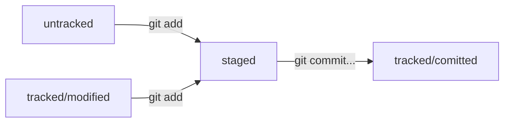

# Шпаргалка. Базовые команды в консоли  

Чтобы было удобнее взаимодействовать с командной строкой, подготовили ЭТУ шпаргалку. В ней собраны все команды, о которых мы рассказали в уроках, и их полезные вариации.  

## Навигация  

- `pwd` (от англ. *print working directory*, «показать рабочую папку») — покажи, в какой я папке;  
- `ls` (от англ. *list directory contents*, «отобразить содержимое директории») — покажи файлы и папки в текущей папке;  
- `ls -a` — покажи также скрытые файлы и папки, названия которых начинаются с символа `.`;  
- `cd first-project` (от англ. *change directory*, «сменить директорию») — перейди в папку `first-project`;
- `cd first-project/html` — перейди в папку `html`, которая находится в папке `first-project`;
- `cd ..` — перейди на уровень выше, в родительскую папку;
- `cd ~` — перейди в домашнюю директорию (`/Users/Username`);
- `cd /` — перейди в корневую директорию.  

## Работа с файлами и папками  

### Создание  

- `touch index.html` (англ. *touch*, «коснуться») — создай файл `index.html`в текущей папке;
- `touch index.html style.css script.js` — если нужно создать сразу несколько файлов, можно напечатать их имена в одну строку через пробел;
- `mkdir second-project` (от англ. *make directory*, «создать директорию») — создай папку с именем `second-project` в текущей папке.  

### Копирование и перемещение  

- `cp file.txt ~/my-dir` (от англ. *copy*, «копировать») — скопируй файл в другое место;
- `mv file.txt ~/my-dir` (от англ. *move*, «переместить») — перемести файл или папку в другое место.  

### Чтение  

- `cat file.txt` (от англ. *concatenate and print*, «объединить и распечатать») — распечатай содержимое текстового файла `file.txt`.  

### Удаление  

- `rm about.html` (от англ. *remove*, «удалить») — удали файл `about.html`;
- `rmdir images` (от англ. *remove directory*, «удалить директорию») — удали папку images;
- `rm -r second-project` (от англ. *remove*, «удалить» + *recursive*, «рекурсивный») — удали папку `second-project` и всё, что она содержит.  

## Полезные возможности  

- Команды необязательно печатать и выполнять по очереди. Можно указать их списком — разделить двумя амперсандами (`&&`).  
- У консоли есть собственная память — буфер с несколькими последними командами. По ним можно перемещаться с помощью клавиш со стрелками вверх (`↑`) и вниз (`↓`).
- Чтобы не вводить название файла или папки полностью, можно набрать первые символы имени и дважды нажать `Tab`. Если файл или папка есть в текущей директории, командная строка допишет путь сама.  
Например, вы находитесь в папке `dev`. Начните вводить `cd first` и дважды нажмите `Tab`. Если папка `first-project` есть внутри `dev`, командная строка автоматически подставит её имя. Останется только нажать `Enter`.  

>💡 __Команд так много — как их запомнить?__  
 __*Терминал*__ — мощный инструмент с практически бесконечным количеством команд и параметров. Не переживайте, если не можете запомнить их все. Использовать поисковики или заглядывать в шпаргалку — абсолютно нормально. Даже специалисты с большим опытом часто обращаются к интернету, чтобы вспомнить вариации той или иной команды.

---
## Хеш — основной идентификатор коммита  

В процессе работы с Git встречается понятие «хеш коммита», странные строчки с бессмысленным (на первый взгляд) набором букв и цифр, которые видны, когда вызываешь команду `git log` и выводишь историю коммитов.  

- если хеш получить дважды для одного и того же набора входных данных, то результат будет гарантированно одинаковый;  
- если хоть что-то в исходных данных поменяется (хотя бы один символ), то хеш тоже изменится (причём сильно).  

## Элементы описания коммита  (`git log`)

После вызова `git log` появляется список коммитов.  
Получить сокращённый лог — `git log --oneline`. Сокращённый лог полезен, если в репозитории уже много коммитов — например, сотни или тысячи.  

> Сокращённый хеш (то есть первые несколько символов полного) можно использовать точно так же, как и полный. Для этого команда `git log --oneline` автоматически подбирает __такую длину__ сокращённых хешей, чтобы они были __уникальными__ в пределах репозитория и Git всегда мог понять, о каком коммите идёт речь.  

## Файл HEAD  

В числе прочих файлов в папке `.git` есть служебный файл `HEAD`. Он указывает на самый свежий коммит.  
Вместо хеша последнего коммита можно написать слово `HEAD` — Git вас поймёт.  

## Статусы файлов в Git  (*untracked*/*tracked*, *staged* и *modified*)

Статусом `untracked` помечается файл, о существовании которого Git знает, но не следит за изменениями в нём. Этот статус — противоположность `tracked`, в который попадают все файлы, отслеживаемые Git.  
Файл переходит в статус `staged` после выполнения `git add`.  
Статус `modified` означает, что файл был изменён.  
Большинство файлов в проектах «шагает» по следующему циклу: «изменён» → «добавлен в список на коммит» → «закоммичен» (`git commmit`) → «изменён» → и так далее.  

