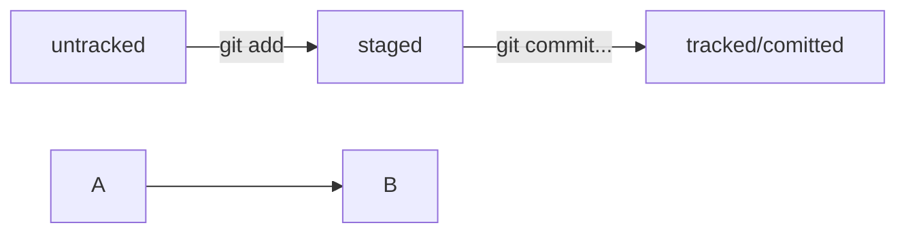

__*Тема 6/8 Урок 2/5*__  

## Практическая работа №2. Дополняем шпаргалку  
Работа над самой удобной шпаргалкой по Git ещё не закончена — в этот раз вы дополните её.   
Мир IT не стоит на месте: в нём постоянно происходят перемены. Например, в коммерческой разработке готовый код редко остается без изменений: обновляются фреймворки, добавляются и совершенствуются функциональности, непрерывно оптимизируется работа всего проекта.  

> 🔑 Кстати, фреймворки и библиотеки значительно облегчают разработку проекта. К ним относятся, например, __Flask__ — микрофреймворк для создания веб-приложений на языке __Python__; __React__ — библиотека с открытым исходным кодом для разработки пользовательских интерфейсов на __JavaScript__; __Express__ — фреймворк для среды разработки __Node.js__, и так далее.  

Подробнее об этих и прочих популярных технологиях, вы можете узнать на наших курсах по программированию — [__«Python-разработчик плюс»__](https://practicum.yandex.kz/python-developer-plus/?from=catalog), [__«Фулстек-разработчик»__](https://practicum.yandex.kz/fullstack-developer/?from=catalog) и других. Вводная часть этих курсов бесплатная...  
  
Подобно всем реальным проектам, ваша шпаргалка тоже требует обновления — ведь с момента прошлой практической работы вы узнали много нового. Дополните её:
1. Добавьте в шпаргалку основную информацию из уроков о хеше, логе, `HEAD`, статусах файлов и оформлении сообщений к коммитам.  
2. Информацию из каждого урока заливайте новым коммитом. Так вам будет проще отслеживать, как меняется шпаргалка и увеличивается объём ваших знаний.   

> 💡 Пишите понятные и информативные сообщения к коммитам. Используйте ключевые слова из названий уроков. Например: `Добавить раздел про HEAD, Дополнить инфу про git log` и так далее.  

3. Особое внимание уделите материалу о статусах и жизненном цикле файлов в Git. Схему изменения статусов можно описать словами. Например, `modified` + `git add` = `staged`.  

А можно усложнить задачу!   
Попробуйте использовать формат описания схем [Mermaid](https://github.blog/2022-02-14-include-diagrams-markdown-files-mermaid/). Принцип такой: вы описываете схему в специальном текстовом формате, а GitHub превращает описание в полноценную схему с блоками и стрелками.

---
### Подсказка: как сделать mermaid-схему  

Чтобы получить `mermaid`-схему в `README.md`, нужно добавить блок кода типа `mermaid`.  

```
HEAD -- это голова.  
Коммит -- это всему голова.  
Статусы файлов:  

<тут пустая строка!>  
  \```mermaid  
  %% описание схемы  
  \```  

<и тут пустая строка!>
  
```

Блоки кода в маркдауне начинаются и заканчиваются тремя символами ` ``` `. После первых трёх ` ``` ` можно указать, какой именно код будет внутри блока. Например: __mermaid__, __bash__, __python__, __javascript__ и так далее. Если ничего не указать, GitHub будет считать весь код простым текстом.  

> 💡 Перед блоком и после него нужны пустые строки, иначе GitHub может не понять, что это блок кода.  

- Два символа `%%` обозначают в `mermaid` строку-комментарий.  
- Чтобы сделать схему, нужно указать формат: `graph LR`. __Graph__ — это простейший тип схем; для шпаргалки его будет достаточно.  
- Чтобы добавить элементы и связи (стрелки), используют строки вида `A --> B`. Такая строка создаст квадратные блоки `А` и `B` и соединит их стрелкой.  

Дополнительно можно указывать текст на стрелке. Например, так: `A -- "text" --> B`.  
Ниже вы найдёте заготовку для схемы статусов файлов.


Попробуйте описать схему самостоятельно и посмотреть, что получится!


