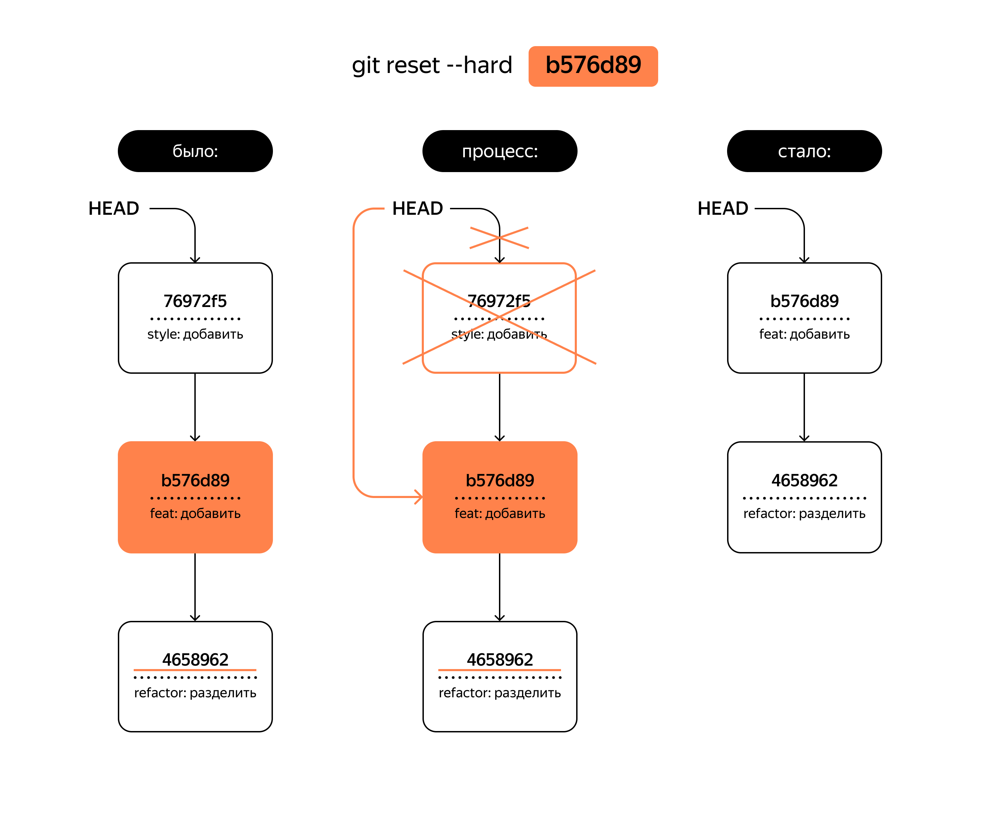

# Как откатиться назад, если «всё сломалось»  

__*Тема 6/8 Урок 4/5*__  

На разных этапах работы с Git могут происходить похожие ситуации:  

- В список на коммит попал лишний файл (например, временный). Нужно «вынуть» его из списка.  
- Последние несколько коммитов ошибочные: например, сделали не то, что было нужно, или нарушили логику. Хочется «откатить» сразу несколько коммитов, вернуть «как было вчера».  
- Случайно изменился файл, который вообще не должен был меняться. Например, вы открыли не тот файл в редакторе и начали его исправлять.  

В этом уроке рассмотрим такие случаи и научим вас «откатывать» нежелательные изменения.

## Выполнить unstage изменений — `git restore --staged <file>`  

Допустим, вы создали или изменили какой-то файл и добавили его в список «на коммит» (`staging area`) с помощью `git add`, но потом передумали включать его туда. Убрать файл из `staging` поможет команда `git restore --staged <file>` (от англ. *restore* — «восстановить»).  

> 💡 В выводе команды `git status` есть подсказка в скобках: `use "git restore --staged <file>..." to unstage`. Так что, даже если вы и забыли эту команду, Git напомнит вам.  

В терминале это будет выглядеть примерно так.

```text
$ touch example.txt # создали ненужный файл
$ git add example.txt # добавили его в staged

$ git status # проверили статус
Changes to be committed:
  (use "git restore --staged <file>..." to unstage)
        new file:   example.txt

$ git restore --staged example.txt
$ git status # проверили статус

Untracked files:
  (use "git add <file>..." to include in what will be committed)
        example.txt

no changes added to commit (use "git add" and/or "git commit -a")
# файл example.txt из staged вернулся обратно в untracked 
```

Вызов `git restore --staged example.txt` перевёл `example.txt` из `staged` обратно в `untracked`.  

Чтобы «сбросить» все файлы из `staged` обратно в `untracked`/`modified`, можно воспользоваться командой `git restore --staged .`: она сбросит всю текущую папку (`.`).  

> 💡 Раньше для этой операции использовали команду `git reset HEAD`. Но `git reset` «перегруженная»: она умеет делать много разных действий в зависимости от переданных параметров. Чтобы было меньше путаницы, в Git была добавлена отдельная команда `git restore`.  

## «Откатить» коммит — `git reset --hard <commit hash>`  

Иногда нужно «откатить» то, что уже было закоммичено, то есть вернуть состояние репозитория к более раннему. Для этого используют команду `git reset --hard <commit hash>` (от англ. *reset*  — «сброс», «обнуление» и *hard* — «суровый»).  

```text
$ git log --oneline # хеш можно найти в истории
7b972f5 (HEAD -> master) style: добавить комментарии, расставить отступы
b576d89 feat: добавить массив Expenses и цикл для добавления трат # вот сюда и вернёмся
4b58962 refactor: разделить analyzeExpenses() на countSum() и saveExpenses()

$ git reset --hard b576d89
# теперь мы на этом коммите
HEAD is now at b576d89 feat: добавить массив Expenses и цикл для добавления трат 
```

Теперь коммит `b576d89` стал последним: вся дальнейшая разработка будет вестись от него. Файл также вернулся к тому состоянию, в котором был в момент этого коммита. А коммит `7b972f5` Git просто удалил. Это можно проверить, снова запросив лог. Он покажет следующее.  

```text
$ git log --oneline
b576d89 (HEAD -> master) feat: добавить массив Expenses и цикл для добавления трат
4b58962 refactor: разделить analyzeExpenses() на countSum() и saveExpenses() 
```

Вот так схематично выглядит весь процесс «отката» с помощью `git reset --hard <hash>`.


Будьте осторожны с командой `git reset --hard`! При удалении коммитов можно потерять что-то нужное.

## «Откатить» изменения, которые не попали ни в __staging__, ни в коммит, — `git restore <file>`  

Может быть так, что вы случайно изменили файл, который не планировали. Теперь он отображается в `Changes not staged for commit` (`modified`). Чтобы вернуть всё «как было», можно выполнить команду `git restore <file>`.  

```text
# случайно изменили файл example.txt
$ git status
On branch main
Changes not staged for commit:
  (use "git add <file>..." to update what will be committed)
  (use "git restore <file>..." to discard changes in working directory)
          modified:   example.txt

$ git restore example.txt
$ git status
On branch main
nothing to commit, working tree clean 
```

Изменения в файле «откатятся» до последней версии, которая была сохранена через `git commit` или `git add`.  

---

> - Вы сделали коммит, после которого «всё сломалось». Какую команду использовать, чтобы «откатить» репозиторий на более ранний коммит?  
>   `git reset --hard <более ранний коммит>`  
> - Вы добавили изменения в `staging area` и хотите вернуть их в `modified`. Какую команду выбрать?  
>   `git restore --staged <файл>`  
> - Вы случайно изменили файл, который вообще не хотели менять. Но в `staging`` его пока не добавили. Какую команду нужно выполнить?  
>   `git restore <файл>`  

---
Вот о чём мы рассказали:  

- Команда `git restore --staged <file>` переведёт файл из `staged` обратно в `modified` или `untracked`.  
- Команда `git reset --hard <commit hash>` «откатит» историю до коммита с хешем `<hash>`. Более поздние коммиты потеряются!  
- Команда `git restore <file>` «откатит» изменения в файле до последней сохранённой (в коммите или в `staging`) версии.  
